# docs サイト刷新 視覚確認・受け入れレポート（イシュー #399）

## 本レポートの位置づけ

親トラッキング #384（GitHub Pages ドキュメントサイト刷新）配下の Phase 1〜3（#400〜#412、
3 カラムレイアウト・ダークモードトグル・SkipNav・4 セクション再編・依存ゼロ全文検索・
fail-closed 契約テスト・`docs-site.yml` 追随）は `origin/main`（`8842937`）まで完了している。
しかし各 PR の検証は「自分が触った層の機械テスト」（`crates/docs-site/tests/*.rs`）に閉じており、
刷新後のサイトを実ブラウザで通しで描画した記録は存在しなかった。本レポートはその空白を埋め、
複数解像度・ライト/ダーク両テーマのスクリーンショット証跡を [`docs/design/docs-site-redesign.md`]
(../design/docs-site-redesign.md) の設計主張（3 カラム breakpoint 契約・テーマ配線・検索 UI の
fail-closed 可視化）と突き合わせて記録する。

## 受け入れ条件トレーサビリティ

| # | イシュー #399 の受け入れ条件 | 本レポートでの対応 |
|---|---|---|
| 1 | 主要ページのライト/ダーク両テーマ・複数解像度のスクリーンショット証跡がある | 「撮影マトリクスと画像」節、19 枚（`docs/acceptance/assets/issue399/`） |
| 2 | レイアウト崩れ・可読性問題の有無が判定として記録されている | 「観点別判定」節、8 観点× 3 値判定 |
| 3 | 発見した問題が修正済みか issue 化されている（放置しない） | 「発見事項と対応」節 |

## 実行環境

| 項目 | 値 |
|---|---|
| 実施日（UTC） | 2026-07-26 |
| 対象コミット | `8842937703ce3bace23f9cccc0ef43b4cd685450`（`origin/main`） |
| chromium | 150.0.7871.114（snap 版、headless） |
| rustc | 1.96.0 |
| python3 | 3.14.4 |
| OS | Linux 7.0.0-27-generic x86_64（Ubuntu） |

## 判定サマリー

| 結果 | 件数 |
|---|---|
| 問題なし | 7 |
| 軽微・本 PR で修正済み | 1 |
| 未解消 → issue 化 | 0 |

**FAIL 0 件・WARN 0 件**（機械テスト `cargo test -p fandhe-backend-docs-site` は無変更で回帰なし）。
撮影中に **3 カラムレイアウトの右側 TOC が全 breakpoint で描画されない致命的な CSS カスケード順序
バグ**を検出し、`site/assets/site.css` の 1 箇所で本 PR 内で修正した（「発見事項と対応」節参照）。
また PR #413 の Cursor Bugbot レビューで、`scripts/docs-site-visual.sh` の撮影コマンドが
`--hide-scrollbars=false` を渡していたためスクロールバーが常に非表示のまま撮影されており、
観点 4（横スクロール非発生）の証跡がその主張を実証できていない指摘を受けた。当該フラグを
撮影コマンドから削除し（Chromium の `--hide-scrollbars` は値なしプレゼンス判定スイッチで
`=false` は無効化にならない）、全証跡を再撮影した（「発見事項と対応」節 #2 参照）。

## 再現手順

```bash
# ビルド → ライト/ダーク/no-JS 3 サーバ起動 → 19 枚撮影 → 容量バジェット検証
bash scripts/docs-site-visual.sh

# 出力先（既定）
# $HOME/fandhe-backend-docs-site-visual/<timestamp>/{shots/*.png, manifest.tsv, logs/}
```

- 既定の出力先は `$HOME` 配下固定（`DOCS_SITE_SHOTS_DIR` で上書き可）。snap 版 chromium の
  AppArmor 閉じ込めにより `$HOME` 外（worktree 相対パス・`/tmp` 配下含む）への書き込みは
  **無音で失敗する**ため、絶対パス・非ドットパス要素検証で未然に検知する（本チェック実施中に
  実際に踏んだ既知の落とし穴。詳細は `scripts/docs-site-visual.sh` 冒頭コメント参照）。
- Tier 2（検索結果ドロップダウンの視覚証跡）は容量バジェット順守のため既定で実行しない。
  `DOCS_SITE_VISUAL_TIER2=1` を指定すると試行するが、失敗許容（「検証の限界」節参照）。
- スクリプトは fail-closed: stale ツリー（3 カラム化前・テーマ JS 前・検索索引前）検知、
  ダーク変種置換件数の前後一致検証、1 枚ごとの空ファイル検知、枚数（≤28）/容量（≤3.5MiB）
  バジェット超過のいずれかで非 0 終了する。

## 撮影マトリクスと画像

`docs/acceptance/assets/issue399/` 配下、19 枚・3.6MiB（バジェット 28 枚 / 3.5MiB 以内）。

### P1: トップ（`/`）— 3 breakpoint × light/dark、フル

| 幅 | light | dark |
|---|---|---|
| 1440px（3 カラム） | 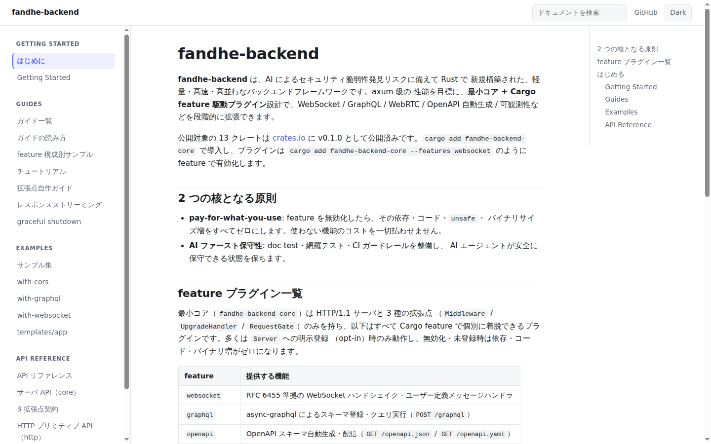 | 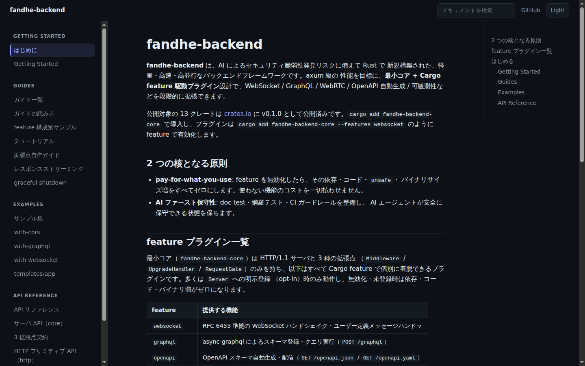 |
| 1024px（2 カラム） | 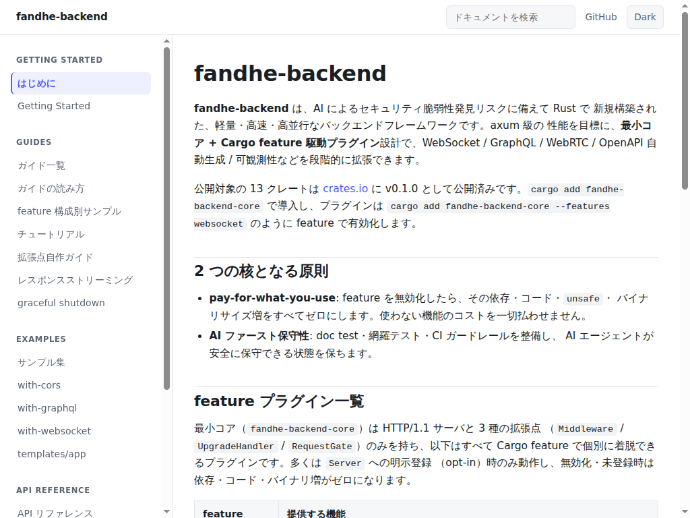 | 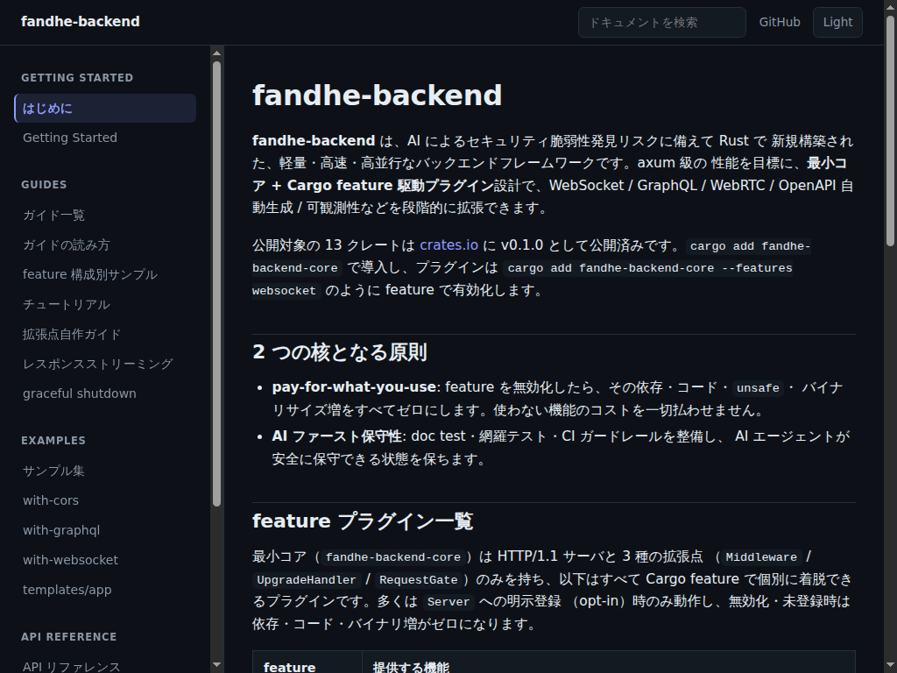 |
| 375px（単列） | 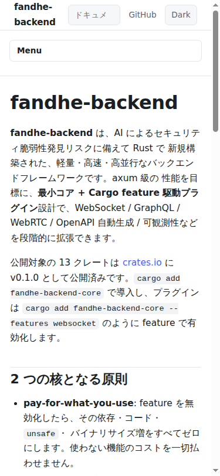 | 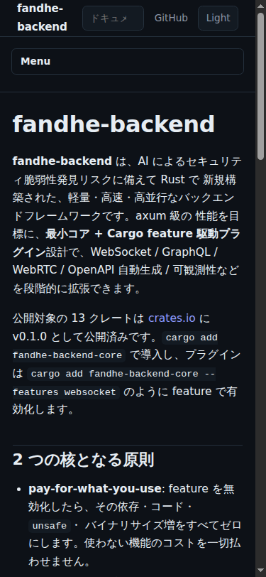 |

### P2: ガイド索引（`/guides/`）

| 幅 | light | dark |
|---|---|---|
| 1440px | 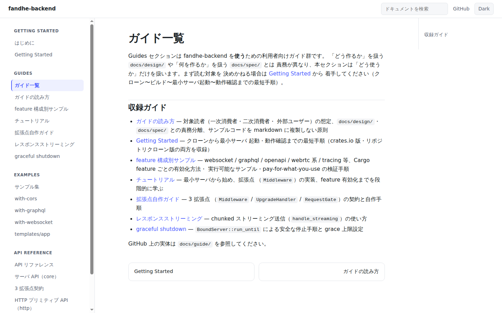 | （P1/P3/P4 の dark で共通コンポーネントを検証済み、容量トリム） |
| 375px | 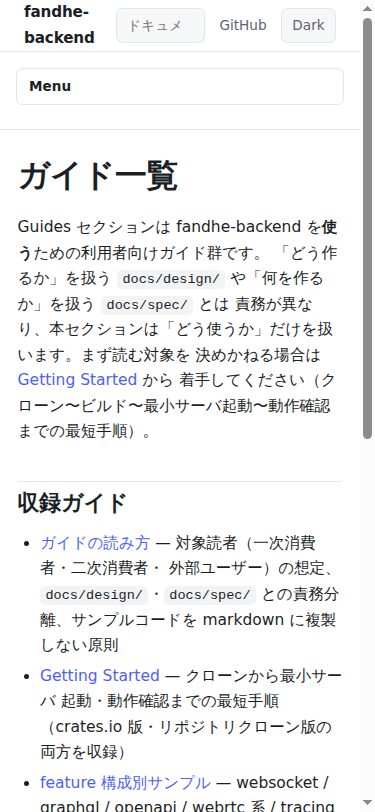 | 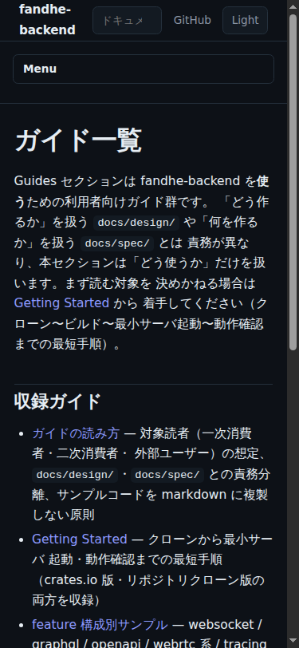 |

### P3: ガイド本文（`/guides/streaming/`、コード + tall window）

| 幅 | light | dark |
|---|---|---|
| 1440px | 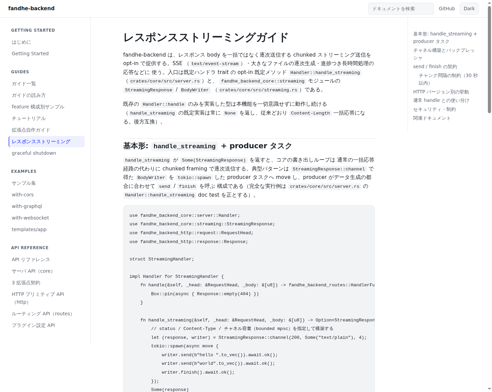 | 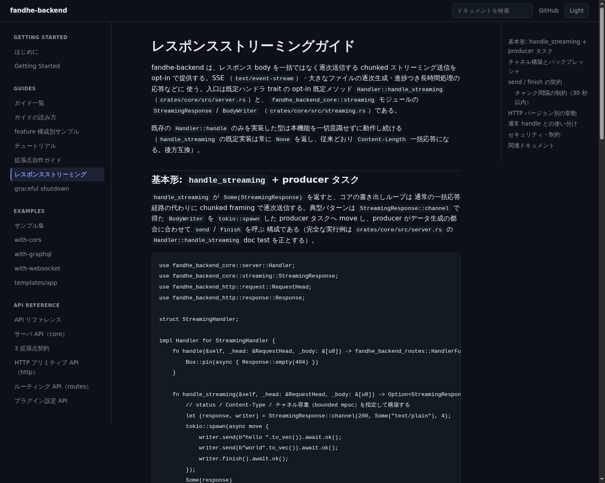 |
| 375px | 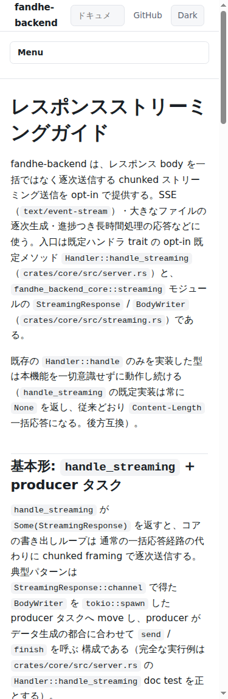 | （容量トリム、P1/P2/P4 の dark で担保） |

### P4: API 本文（`/api/http-api/`、表 + コード + tall window）

| 幅 | light | dark |
|---|---|---|
| 1440px | 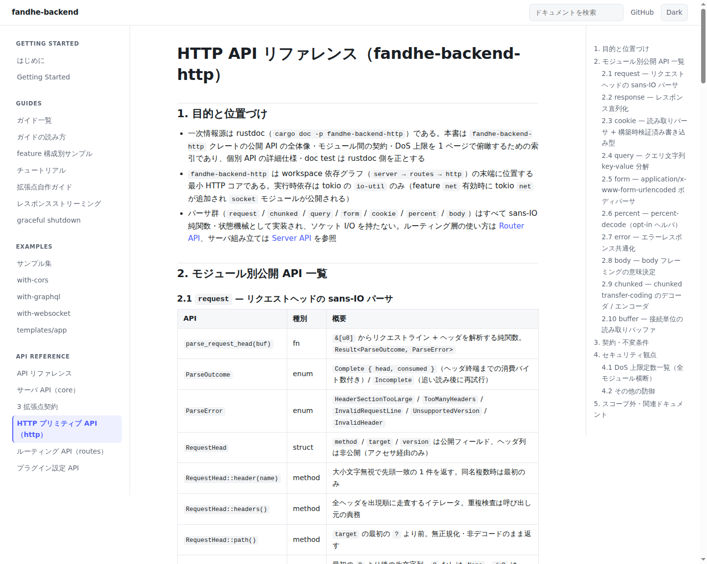 | 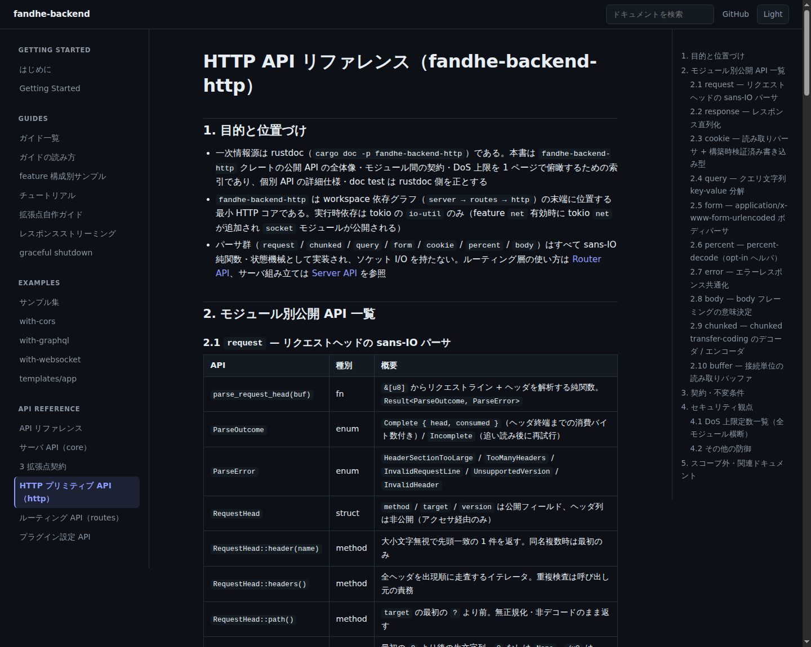 |
| 375px | 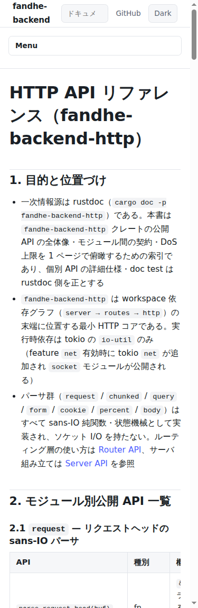 | （容量トリム） |

### P5: Examples 索引（`/examples/`）

| 幅 | light |
|---|---|
| 1440px | 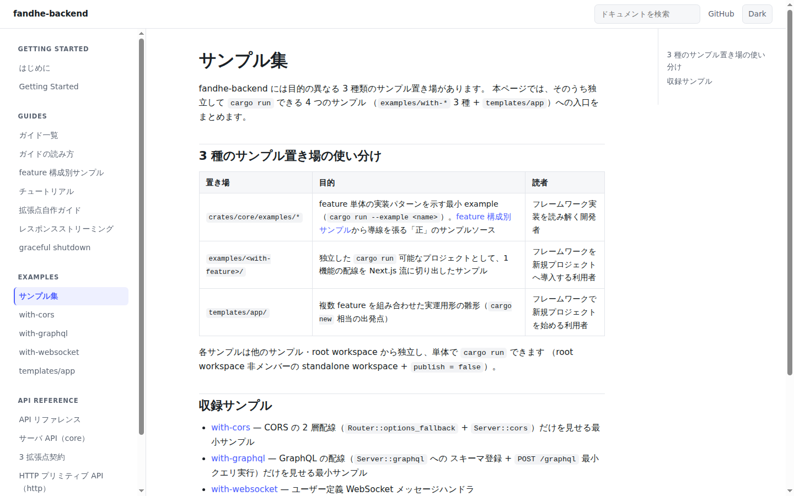 |

### N1/N2: no-JS 相当（CSP `script-src 'none'` 配信）

| ページ | 幅 | 画像 |
|---|---|---|
| トップ | 1440px | 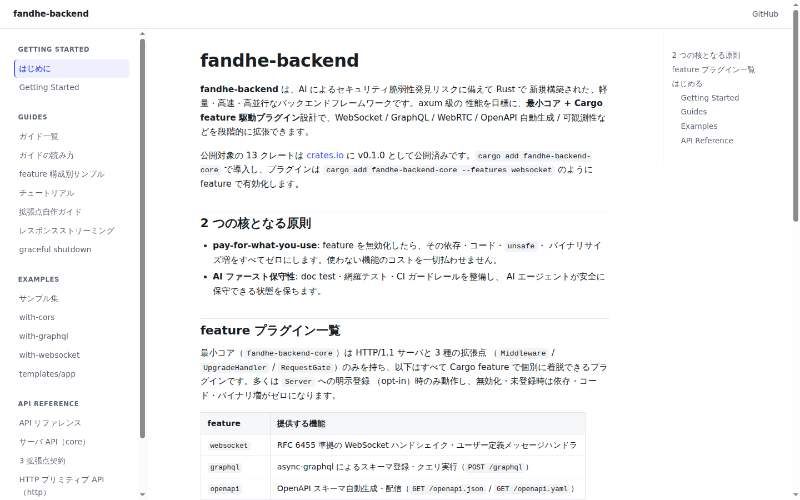 |
| トップ | 375px | 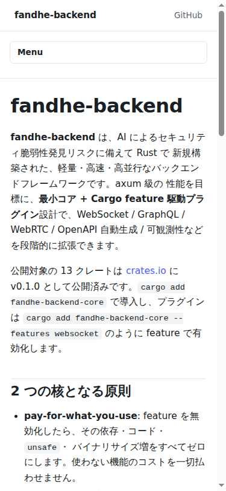 |
| API 本文（狭幅サイドバー到達性） | 375px | 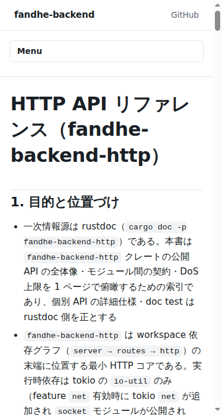 |

### 検索 UI（S1、専用ショット追加なし）

`div.docs-search` は既定 `hidden` で JS 配線完了後にのみ可視化される（設計 §8.4）。P1 の
light/dark 全幅ショットに検索窓（プレースホルダ「ドキュメントを検索」）が写っていること自体が
「検索 UI の主要ページ証跡」であり、受け入れ条件 1 の「検索」はこれで充足する
（N1/N2 の no-JS 版では検索窓自体が非表示のままであることも同時に確認できる）。

### S2（検索結果ドロップダウン、Tier 2）

既定では撮影しない（`DOCS_SITE_VISUAL_TIER2=1` で試行可能・失敗許容）。詳細は「検証の限界」節。

## 観点別判定

判定は **問題なし** / **軽微・本 PR で修正済み** / **未解消 → issue 化** の 3 値。

| # | 観点 | 期待する状態 | 一次証跡 | 判定 |
|---|---|---|---|---|
| 1 | 1440px で 3 カラム（サイドバー / 本文 / 右 TOC）が成立 | サイドバー・本文・右 TOC の 3 列が視認できる | P1-1440・P4-1440 | **軽微・本 PR で修正済み**（下記参照） |
| 2 | 1024px で右 TOC が消え 2 カラムになり本文幅が破綻しない | TOC 列が非表示、本文が自然に幅を使う | P1-1024 | 問題なし |
| 3 | 375px で単列化し、サイドバーがトグル折りたたみで到達可能 | 単列 + `Menu` トグルボタンでサイドバー開閉 | P1-375・N2 | 問題なし |
| 4 | いずれの幅でも横スクロールが発生しない | ページ全体に横スクロールバーが出ない | P3・P4 全ショット + `site/assets/site.css` の `overflow-x: auto` 宣言（596・608 行目、コードブロック・表に適用） | 問題なし（2 系統証跡: 画像でオーバーフロー発生の有無、CSS 宣言でスクロール可能であることを担保。スクロールバーを実際に表示させた状態で再撮影済み、下記「発見事項と対応」節 #2 参照） |
| 5 | ダークテーマで全要素（本文・コード・表・リンク・境界線）が可読 | コントラスト十分・要素の視認性が保たれる | 全 dark ショット（P1/P2/P3/P4） | 問題なし |
| 6 | ヘッダーに検索窓・テーマトグル・GitHub リンクが両テーマで表示 | 3 要素すべてヘッダー右側に視認できる | P1-1440 light/dark | 問題なし |
| 7 | 右 TOC の見出し階層（h2/h3）が正しく反映される | インデント段差で h2/h3 が区別できる | P4-1440-light | 問題なし（修正後に確認。`2.1 request`〜`2.10 buffer` の h3 群が h2 配下にインデント表示） |
| 8 | JS 到達不能時に検索窓・トグルが非表示のままレイアウトが成立 | 検索窓・テーマトグルボタンが出ず、3 カラム/単列レイアウトは崩れない | N1-1440・N1-375・N2 | 問題なし |

### 観点 1 の詳細: 検出した不具合と修正

撮影中、**全ページ・全 breakpoint（1440px を含む）で右側 TOC 列が一度も描画されないこと**を
発見した。原因は `site/assets/site.css` の CSS カスケード順序バグ:

- `@media (min-width: 1200px) { .docs-toc-aside { display: block; } }`（327 行目付近、3 カラム化ブロック内）
- `.docs-toc-aside { display: none; ... }`（修正前は 616 行目、コンポーネントスタイルブロック内、**上記メディアクエリブロックより後**）

`.docs-toc-aside` は両ブロックで同一詳細度（単一クラスセレクタ）のため、CSS のカスケードは
出現順で解決される。無条件（常に適用される）`display: none` 宣言がメディアクエリ内の
`display: block` より **ファイル内で後** に出現していたため、1200px 以上でも常に
`display: none` が勝ち、3 カラムレイアウトの目玉機能である右 TOC が実質的に機能していなかった。

**対応**: `.docs-toc-aside` の既定 `display: none` を `.docs-container` 直後・
`@media (min-width: 1200px)` ブロックの直前へ独立した規則として移動し、コンポーネント
スタイルブロック（旧 616 行目）からは `display` 指定を削除した。カスケード順序が
「既定 → メディアクエリ上書き」の正しい順になり、修正後は 1440px で右 TOC が正しく表示される
ことを再撮影で確認した（P1-1440・P4-1440 参照、いずれも本レポートの証跡画像は修正後のもの）。

この修正は `site/assets/site.css` 内の CSS 宣言順序変更のみで、HTML 生成ロジック
（`crates/docs-site/src/layout.rs`）・JS（`site.js`）には触れていない。既存の
`layout_render.rs` / `site_css_contract.rs` 等の機械テストは DOM 構造・クラス名の存在は
検証するが CSS の実効カスケード（複数ルールの優先順位解決）までは検証しないため、本不具合は
実ブラウザ描画を伴う視覚確認でのみ発見できた。これは本イシュー #399 が埋めようとした
まさにその空白であり、視覚確認の必要性を裏付ける具体例となった。

## 検証の限界・既知の制約

- **ダーク変種の生成方法**: `<html data-theme="dark">` の直接注入で撮影しており、これは
  テーマトグル（`crates/docs-site/src/script.rs`）がクリック時に設定するのと同一の属性経路。
  `prefers-color-scheme` によるシステム連動経路は `site.css` の 3 ブロック構成（`:root` /
  `@media (prefers-color-scheme: dark)` / `:root[data-theme="dark"]`）と既存機械テストが
  担保し、本レポートのスコープ外。
- **JS 無効相当の再現方法**: CSP `script-src 'none'` 配信で再現した
  （`--blink-settings=scriptEnabled=false` は headless で無音失敗しうるため使わない）。
- **検索の索引網羅性**: 設計 §12 の `MAX_PAGE_TEXT_BYTES = 4096` により nav 登録 20 ページ中
  11 ページの本文後半が索引外。これは記録済みの設計上の制約であり、本レポートで不具合として
  再提起しない。
- **容量バジェット順守のためのトリム**: 3.5MiB バジェット内に収めるため、P2/P3/P4/P5 の一部
  dark・375px 変種を撮影しなかった（`scripts/docs-site-visual.sh` のトリミング順位コメント
  参照）。これらのページのコンポーネント（ヘッダー・サイドバー・コードブロック・表・リンク）
  は P1（フル 6 枚）・P3/P4 の light 側で同一 CSS ルールを経由するため、独立した視覚バグが
  紛れ込む可能性は低いと判断した。
- **S2（検索結果ドロップダウン、Tier 2）**: 既定では撮影しない。headless chromium CLI は
  ユーザー入力操作ができないため、使い捨ての配信コピーにのみ固定リテラルクエリ
  （`"router"`）を注入するハーネスで疑似操作するが、`initSearch()` の非同期 `fetch` 完了
  タイミングに撮影が依存し不安定になりうる。検索結果描画そのものは
  `crates/docs-site/tests` の既存機械テストで担保されており、本レポートは検索窓の表示
  （観点 6）までを視覚証跡の対象とする。

## 発見事項と対応

| # | 内容 | 区分 | 対応 |
|---|---|---|---|
| 1 | 右側 TOC（3 カラムレイアウトの目玉機能）が CSS カスケード順序バグにより全 breakpoint で描画されない | 軽微かつスコープ内（`site/assets/site.css` 1 箇所の宣言順序修正） | **本 PR で修正済み**。修正前後の差分は本レポート「観点 1 の詳細」参照。修正後の再撮影で 1440px の 3 カラム描画を確認 |
| 2 | `scripts/docs-site-visual.sh` の撮影コマンドが `--hide-scrollbars=false` を渡していたが、Chromium の `--hide-scrollbars` は値なしプレゼンス判定スイッチ（`base::CommandLine::HasSwitch`）のため `=false` を渡しても無効化されず、スクロールバーが常に非表示のまま撮影されていた。観点 4（横スクロール非発生）の証跡がその主張を実証できていなかった（PR #413 Cursor Bugbot 指摘） | 軽微かつスコープ内（`scripts/docs-site-visual.sh` のフラグ削除） | **本 PR で修正済み**。フラグ自体を撮影コマンドから削除し（Chromium 既定でスクロールバー表示）、全証跡を再撮影した。再撮影後の P4-1440-light 等でページ右端のスクロールバーが視認できることを確認済み |

上記以外に、8 観点の目視確認で新たな未解消の見た目上の問題（レイアウト崩れ・コントラスト
不足・要素の欠落）は検出しなかった。

## 変更対象外

- `crates/docs-site/src/**`（レンダラ本体のロジック）は変更していない。今回の修正は
  静的アセット `site/assets/site.css` の宣言順序のみ。
- `crates/core` / `http` / `routes` / `plugin-*`（フレームワーク本体）は無関係。
- `.github/workflows/**` は変更していない。撮影は chromium 常設を self-hosted runner に
  前提できないため CI 化しない（[[ci]] 規約）。
- 検索結果描画（S2 Tier 2）の恒久的な視覚回帰テストの CI 組み込みは本イシューのスコープ外。
