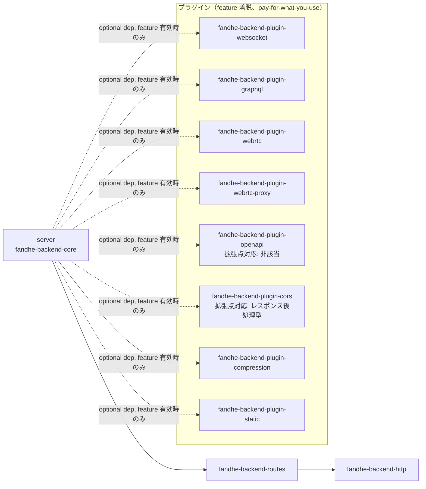

# 依存グラフ・契約ドキュメント（TASK-13.2 / #50）

`docs/spec/04-requirements.md` REQ-13「変更影響範囲の機械判定構造」の受け入れ基準
(1) 新規プロトコル・機能の追加が既存 3 拡張点のいずれかに閉じるか、閉じない場合は
その理由が設計文書に明記される、(2) モジュール境界・依存方向が `lib.rs` 等の doc
コメントで機械可読に明示されている、の 2 点を満たすための**正準ドキュメント**。

TASK-13.1（#49）は拡張点への変更影響範囲閉包を実例（WebSocket / GraphQL / WebRTC）
で検証し（`docs/design/extension-closure-verification.md`）、判定エンジン
（`scripts/extension-closure-check.sh`）を確立した。本書はその 7 節で挙げられた
引き継ぎ事項（doc コメントでの機械可読化・CI 常設運用の確立）を消化する。

## 1. 正準依存グラフ

workspace の依存方向は `server → routes → http::*` の一方向を基本とし、これに
プラグインの依存逆転エッジ（コンパイル時 `optional = true` + `dep:` 構文による
feature 着脱）が加わる。

**この依存グラフの唯一の正（機械検証ソース）は
`scripts/dep-direction-check.sh` の `allowed_edge_patterns` 配列である。**
本書の図・表はそこからの**転記**であり、二重管理を避けるため次の規約を置く。

> `allowed_edge_patterns` を変更する PR は、同一 PR 内で本書 1 節の図・表も
> 追随更新すること。乖離を検知する機械検証は現時点では未整備であり
> （8 節「スコープ外」参照）、レビューでの確認に依存する。

### 1.1 依存グラフ図



- 実線（`server → routes → http::*`）: 常時有効な一方向コア依存。循環なし
- 破線（`server -.-> fandhe-backend-plugin-*`）: feature 無効時は `cargo tree` に一切現れない
  （pay-for-what-you-use、`.claude/rules/pay-for-what-you-use.md`）コンパイル時依存逆転
- `fandhe-backend-plugin-openapi` は他プラグインと同じコンパイル時依存逆転エッジ
  （`fandhe-backend-core:fandhe-backend-plugin-openapi`、TASK-2.1 / #256 で配線済み）を
  持つが、実行時拡張点（`Middleware`/`UpgradeHandler`/`RequestGate`）のいずれにも
  乗らない「拡張点対応: 非該当」区分は維持する（5 節参照。プラグイン側は
  ハンドラを持たず定数 `OPENAPI_JSON` を公開するのみで、`plugin::try_intercept`
  側の同期分岐が返却するだけの接続のため）

### 1.2 許可エッジ一覧（`allowed_edge_patterns` からの転記）

| from | to | 種別 |
|---|---|---|
| `fandhe-backend-core` | `fandhe-backend-http` | コア一方向依存 |
| `fandhe-backend-core` | `fandhe-backend-routes` | コア一方向依存 |
| `fandhe-backend-core` | `fandhe-backend-plugin-webrtc-proxy` | プラグイン依存逆転（パスインターセプト型） |
| `fandhe-backend-core` | `fandhe-backend-plugin-webrtc` | プラグイン依存逆転（パスインターセプト型） |
| `fandhe-backend-core` | `fandhe-backend-plugin-websocket` | プラグイン依存逆転（Upgrade 型） |
| `fandhe-backend-core` | `fandhe-backend-plugin-graphql` | プラグイン依存逆転（パスインターセプト型） |
| `fandhe-backend-core` | `fandhe-backend-plugin-openapi` | プラグイン依存逆転（パスインターセプト型の静的サービング変種、TASK-2.1 / #256） |
| `fandhe-backend-core` | `fandhe-backend-plugin-cors` | プラグイン依存逆転（レスポンス後処理型、イシュー #305） |
| `fandhe-backend-core` | `fandhe-backend-plugin-compression` | プラグイン依存逆転（レスポンス後処理型の第 2 インスタンス、イシュー #321） |
| `fandhe-backend-core` | `fandhe-backend-plugin-static` | プラグイン依存逆転（パスインターセプト型、イシュー #318） |
| `fandhe-backend-routes` | `fandhe-backend-http` | コア一方向依存 |
| `fandhe-backend-plugin-*` | `fandhe-backend-http` | プラグイン→コア基盤層参照（許可） |
| `fandhe-backend-plugin-*` | `fandhe-backend-routes` | プラグイン→コア基盤層参照（許可） |
| `fandhe-backend-plugin-*` | `fandhe-backend-core` | 汎用パターン（現状 `fandhe-backend-plugin-websocket` は循環回避のため不使用） |

上記以外のエッジ（逆方向・未許可のプラグイン依存等）は `dep-direction-check.sh`
チェック 1 が非 0 終了で検出する。循環依存は同スクリプト内 DFS で別途検出する
（多層防御）。

## 2. 契約一覧（拡張点・シームと実装クレートの対応）

`docs/design/plugin-boundary.md` 3〜5 節が定義する拡張点・シームの契約を、
実装クレート対応表として集約する。

| # | 拡張点 / シーム | trait / シグネチャ | dyn 互換性 | 同期/非同期 | 実装クレート | 契約・前提条件 |
|---|---|---|---|---|---|---|
| 1 | `Middleware` | `crates/core/src/extension.rs` | dyn 互換 | 同期 | （現状該当実装なし、将来用） | リクエスト前後処理への割り込み |
| 2 | `UpgradeHandler` | 同上（`try_handle_upgrade`） | dyn 互換 | 同期（委譲判定のみ）+ 実処理は非同期委譲 | `fandhe-backend-plugin-websocket` | 「委譲判定のみ」を担い、ハンドシェイク検証・101 応答送出・フレーミングはプラグイン側に閉じる契約（REQ-4） |
| 3 | `RequestGate` | 同上 | dyn 互換 | 同期 | （現状該当実装なし、将来用） | リクエスト可否判定 |
| 4 | `try_intercept`（固定シーム） | `crates/core/src/plugin.rs` | — | 非同期 | `fandhe-backend-plugin-graphql`・`fandhe-backend-plugin-webrtc`・`fandhe-backend-plugin-webrtc-proxy`・`fandhe-backend-plugin-static` | 3 trait はいずれも dyn 互換性のため同期 API 限定であり、非同期の上流中継・クエリ実行・`spawn_blocking` を伴うファイル I/O を要するプラグインは既存拡張点経由の依存逆転で表現できない（`dep-direction-check.sh` 該当コメント）。パスインターセプト型は cfg-gated 分岐として `try_intercept` に集約され、`Option` フォールスルーで次のプラグインへ委譲する（`docs/design/plugin-boundary.md` 4 節） |
| 5 | `finalize_response`（固定シーム） | `crates/core/src/plugin.rs` | — | 同期 | `fandhe-backend-plugin-cors`・`fandhe-backend-plugin-compression` | `Middleware::on_response` がレスポンスへの参照を持たない観測専用契約のため、応答内容自体を書き換える必要があるプラグインは既存 3 trait のいずれでも表現できない（イシュー #305、圧縮は #321 で第 2 インスタンスとして追加）。`try_intercept` 応答・既定 `Handler` 応答の双方に対する単一の後処理合流点として機能し、複数登録時は CORS → 圧縮の順で逐次適用する（`docs/design/plugin-boundary.md` 5.9・5.10 節） |

3 拡張点 trait（`Middleware` / `UpgradeHandler` / `RequestGate`）+ `try_intercept` +
`finalize_response` の固定シーム計 5 つが「変更影響範囲を機械判定できる閉じたシーム」の
全体集合である（`docs/design/extension-closure-verification.md` 3.4 節・
`docs/design/plugin-boundary.md` 5.9 節）。

## 3. 機械可読宣言の規約

### 3.1 形式

各 `crates/plugin-*/src/lib.rs` の冒頭 doc（`//!`、モジュール要約行の直後）に、
次の統一形式 1 行を必ず含める。

```
//! 拡張点対応: <値>
```

### 3.2 許可語彙

| 値 | 適用クレート | 補足 |
|---|---|---|
| `UpgradeHandler（try_handle_upgrade）` | `fandhe-backend-plugin-websocket` | Upgrade 型シーム |
| `パスインターセプト型（try_intercept）` | `fandhe-backend-plugin-graphql`・`fandhe-backend-plugin-webrtc`・`fandhe-backend-plugin-webrtc-proxy`・`fandhe-backend-plugin-static` | 3 trait 非該当だがシグネチャ固定シームに閉じる。宣言直後に `docs/design/extension-closure-verification.md` への参照を必須とする |
| `Middleware` | （現状該当なし、将来用） | 新規実装時にこの語彙で宣言する |
| `RequestGate` | （現状該当なし、将来用） | 同上 |
| `非該当（<理由の参照: docs/design/*.md>）` | `fandhe-backend-plugin-openapi` | ビルド時生成でランタイム拡張点を使わない。理由の実体は本書 5 節。参照先ファイルの存在を機械検査する |
| `レスポンス後処理型（finalize_response）` | `fandhe-backend-plugin-cors` | 3 trait 非該当だがシグネチャ固定シームに閉じる（イシュー #305）。宣言直後に `docs/design/plugin-boundary.md` 5.9 節への参照を必須とする |

`core` / `http` / `routes` / `axum-ref` は本宣言の対象外とする（プラグイン境界の
宣言であるため）。これらは既存の依存方向宣言（`server → routes → http::*`、
`dep-direction-check.sh` チェック 2）で機械検証済み。

### 3.3 検査手段

- `scripts/accept/req13-change-impact-accept.sh` 基準 B が、`crates/plugin-*/src/lib.rs`
  全件について宣言の存在・語彙のホワイトリスト適合・非該当/パスインターセプト型宣言の
  参照先ファイル存在を機械検査する（4 節参照）
- 新規プラグイン追加時は、当該クレートの `src/lib.rs` に本宣言を含めることを
  レビューで確認する（機械検査は基準 B が担うため、レビューは宣言の**妥当性**
  ＝実装が宣言どおりの拡張点に閉じているかを見る）

## 4. 非該当時の理由明記運用（新規プロトコル・機能追加が拡張点に閉じない場合）

REQ-13 受け入れ基準「新規プロトコル・機能の追加が既存 3 拡張点のいずれかに閉じるか、
閉じない場合はその理由が設計文書に明記される」を、機械的に強制する PR ゲートとして
`scripts/extension-closure-gate.sh` を運用する。

### 4.1 運用手順

1. `crates/plugin-*` または `crates/core/src/plugin.rs` を変更する PR は、CI 上で
   `scripts/extension-closure-gate.sh --base origin/${{ github.base_ref }}`
   が自動実行される（`.github/workflows/ci.yml` `unsafe-triage` ジョブ）
2. 変更ファイルが `scripts/extension-closure-check.sh` の A〜D カテゴリに全て
   収まる場合、ゲートは PASS する
3. E（閉包違反候補）ファイルが 1 件でもある場合、**同一 PR 内で `docs/design/`
   配下のいずれかの設計文書に当該ファイルパスを含む理由記載を追加**しない限り
   CI は FAIL する
4. 理由記載がある場合、ゲートは「理由明記済み逸脱」として WARN 付き PASS とする

### 4.2 記載様式

E ファイルの理由記載は、`docs/design/` 配下の設計文書（新規または既存）に次の
4 項目を含める（`docs/design/extension-closure-verification.md` 3.2 節を実例とする）。

1. **対象コミット/PR**: 当該変更の PR 番号・merge commit sha
2. **E ファイルパス**: 閉包の外に出たファイルの相対パス
3. **閉じない理由**: なぜ A〜D のいずれにも収まらなかったか
4. **正当性根拠**: プラグイン実装ロジックの漏出でないことの説明・依存方向への影響有無

### 4.3 記載例（TASK-10.6 / #90 / PR #156）

`crates/plugin-tracing` にバックプレッシャー・ログ欠落率計測用の doc test 例
（`examples/backpressure_probe.rs`）とテスト（`tests/backpressure.rs`）を追加した
変更で、`extension-closure-check.sh` の分類規則（`benches/**` は D「ドキュメント・
運用」の `docs/*`・`scripts/*` glob に該当せず E 判定になる）に基づき、以下 2 件が
E（閉包違反候補）と判定された。

1. **対象コミット/PR**: PR #156（#90、HEAD sha `aa326f1d6dec8523c0b4383a56631cebeaaa41ad`）
2. **E ファイルパス**:
   - `benches/reports/task-10.6-tracing-backpressure.md`
   - `benches/tracing-backpressure-bench.sh`
3. **閉じない理由**: いずれも `benches/` 配下の計測ハーネス・実測レポートであり、
   `extension-closure-check.sh` の分類規則が D として明示的に許可するのは
   `docs/*`・`scripts/*` 等の glob のみで `benches/*` は含まれないため、機械的に
   A〜D いずれにも一致せず E（閉包違反候補）に分類される
4. **正当性根拠**: 両ファイルは `crates/plugin-tracing` の実装ロジック（拡張点
   `Middleware` 経由の非同期バッファ済み I/O、5 節参照ではなく本書 2 節契約一覧の
   `Middleware` 行）そのものを変更するものではなく、既存構成（既定 lossy=true の
   `tracing_appender::non_blocking`）の高負荷時ログ欠落率を計測するベンチスクリプト
   （`benches/tracing-backpressure-bench.sh`）とその実測結果レポート
   （`benches/reports/task-10.6-tracing-backpressure.md`）に過ぎない。計測対象の
   拡張点契約（`Middleware`）・依存方向（`server → routes → http::*`、1 節）には
   一切影響しない。`benches/README.md`（同一 PR で追加、A〜D の D に該当し PASS 済み）
   に運用手順を記載済みであり、`benches/` 配下のベンチ追加が閉包違反候補となる本件は
   `extension-closure-check.sh` の分類規則が `benches/*` を D に含めていないことに
   起因する運用上のギャップであって、拡張点設計の閉包漏れではない
   （`.claude/rules/out-of-scope-tracking.md` 対象として、`extension-closure-check.sh`
   の D カテゴリに `benches/*` を追加する是正は別 Issue で扱う）

### 4.4 記載例（TASK-10.4 / #59 / PR #159）

`crates/plugin-tracing` の `tracing` feature 有効時における `GET /health` の
NFR（RPS 比・p95 比、REQ-10）再検証で、サンプリング（TASK-10.2）・イベント統合
（TASK-10.2）・高頻度パス除外（TASK-10.3）を全適用した構成が受け入れ帯に収まることを
計測するハーネス・計測対象サーバ実装・実測レポートを追加した変更で、4.3 節と同様の
理由（`extension-closure-check.sh` の分類規則が D として許可するのは `docs/*`・
`scripts/*` 等の glob のみで `benches/*` や `crates/core/examples/*` は対象外）により、
以下 4 件が E（閉包違反候補）と判定された。

1. **対象コミット/PR**: PR #159（#59、HEAD sha `c5330e4ee4f15b833d3211532baf5ad834c76b7c`）
2. **E ファイルパス**:
   - `benches/reports/task-10.4-tracing-performance.md`
   - `benches/tracing-nfr-bench.sh`
   - `crates/core/examples/minimal.rs`
   - `crates/core/examples/tracing_nfr.rs`
3. **閉じない理由**:
   - `benches/tracing-nfr-bench.sh`・`benches/reports/task-10.4-tracing-performance.md` は
     4.3 節と同一の運用上のギャップ（`benches/*` が D 未対応）により E 判定となる、
     計測ハーネスと実測結果レポートである
   - `crates/core/examples/minimal.rs`・`crates/core/examples/tracing_nfr.rs` は
     `crates/core` 配下だが `examples/*` であり `extension-closure-check.sh` の
     A（プラグインクレート内）は `crates/plugin-*` を対象、B（コア側許容シーム）は
     `crates/core/src/plugin.rs` 等の拡張点シーム本体を対象とするため、いずれにも
     一致せず E 判定となる
4. **正当性根拠**:
   - `benches/tracing-nfr-bench.sh`・`benches/reports/task-10.4-tracing-performance.md`
     は `fandhe-backend-plugin-tracing` の実装ロジック（拡張点 `Middleware`、2 節契約一覧の
     `Middleware` 行）そのものを変更せず、既存構成の NFR を計測・記録するのみで、
     計測対象の拡張点契約・依存方向（`server → routes → http::*`、1 節）には影響しない
   - `crates/core/examples/minimal.rs` は既存の負荷計測対象サンプルに `GET /health`
     ルートを追加したのみで、コアの拡張点（`Middleware` / `UpgradeHandler` /
     `RequestGate`）や `crates/core` の公開 API 契約を変更しない（既存 `GET /` は無変更、
     他 NFR ベンチへの影響なしを実測確認済み、PR #159 本文参照）
   - `crates/core/examples/tracing_nfr.rs` は新規追加だが、`tracing` feature 経由で
     `Server::tracing` を呼び出すだけの計測対象サーバであり、`Middleware` 拡張点の
     契約自体（`crates/plugin-tracing` 側の実装）は変更しない。`crates/core/Cargo.toml`
     の `required-features = ["tracing"]` によって `tracing` feature 無効時にはビルド
     対象外となり、pay-for-what-you-use 原則（`.claude/rules/pay-for-what-you-use.md`）
     にも抵触しない
   - 4 件とも `crates/plugin-tracing` の実装ロジックの漏出ではなく、既存拡張点契約を
     計測・実証する周辺資産に留まる。`benches/*` を D カテゴリに追加する是正は 4.3 節と
     同一の別 Issue 対象とし、`crates/core/examples/*` の扱いについても
     `extension-closure-check.sh` の分類規則見直しの要否を含め
     `.claude/rules/out-of-scope-tracking.md` 対象として同一の是正検討に含める

### 4.5 記載例（TASK-9.3 / #63 / PR #161）

`crates/plugin-hub-wiring` の `RequestGate` 拡張点実装（`TenantGate::check`）が
`verify_token`（RS256 署名検証）を毎回呼び出していた重複を、`Authenticator` による
リクエストスコープの検証結果キャッシュで解消した変更で、4.3 節・4.4 節と同一の理由
（`extension-closure-check.sh` の分類規則が D として許可するのは `docs/*`・`scripts/*`
等の glob のみで `benches/*` は対象外）により、以下 1 件が E（閉包違反候補）と判定された。

1. **対象コミット/PR**: PR #161（#63、HEAD sha `5e0a81db8991f9dd0d07b0e08f464e21e246b1fc`）
2. **E ファイルパス**:
   - `benches/reports/task-9.3-jwt-cache-performance.md`
3. **閉じない理由**: 4.3 節・4.4 節と同一の運用上のギャップ（`benches/*` が D 未対応）
   により E 判定となる、キャッシュ導入前後のコスト比較（RS256 署名検証の重複解消）を
   記録した実測レポートである。なお同一変更で追加した計測ハーネス本体
   （`crates/plugin-hub-wiring/examples/jwt_cache_bench.rs`）はプラグインクレート内
   （A）に該当し PASS 済みで、E 判定はレポート md ファイルのみ
4. **正当性根拠**: 本レポートは `fandhe-backend-plugin-hub-wiring` の `RequestGate` 実装
   （`TenantGate::check`、2 節契約一覧の `RequestGate` 行）そのものの契約を変更する
   ものではなく、検証結果キャッシュ導入によるレイテンシ・スループット改善を計測・記録
   するのみで、拡張点契約・依存方向（`server → routes → http::*`、1 節）には影響しない。
   `Authenticator` はキャッシュ未ヒット時に必ず `verify_token` へフェイルクローズで
   委譲し（鍵ローテーション・`exp` は都度再判定）、`GateOutcome` が判定結果のみを運ぶ
   契約（`crates/core/src/extension.rs` doc）も変更していない。`benches/*` を D
   カテゴリに追加する是正は 4.3 節・4.4 節と同一の別 Issue 対象とする

### 4.6 記載例（TASK-9.5 / #65 / PR #163）

`crates/plugin-hub-wiring` の `RequestGate` 拡張点実装（`TenantGate`）をリンクした
hub サービス（`examples/hub_service_demo.rs`）が、無関係パス（`GET /`）への
RPS・p95 レイテンシに与える影響（NFR-6、`docs/spec/04-requirements.md`）を、
ベースライン（`examples/minimal`）との比較で実測した変更で、4.3 節〜4.5 節と同一の
理由（`extension-closure-check.sh` の分類規則が D として許可するのは `docs/*`・
`scripts/*` 等の glob のみで `benches/*` は対象外）により、以下 2 件が E（閉包違反候補）
と判定された。

1. **対象コミット/PR**: PR #163（#65、HEAD sha `aad82ce29a745a6195e43157112d17d0ceeadd09`）
2. **E ファイルパス**:
   - `benches/hub-nfr6-bench.sh`
   - `benches/reports/task-9.5-hub-wiring-performance.md`
3. **閉じない理由**: 4.3 節〜4.5 節と同一の運用上のギャップ（`benches/*` が D 未対応）
   により E 判定となる、`fandhe-backend-plugin-hub-wiring` リンクコスト・opt-in（ゲート有効時）
   コストを計測するベンチスクリプトとその実測結果レポートである
   （`benches/graphql-nfr6-bench.sh`・`benches/webrtc-nfr6-bench.sh` と同型、
   `benches/hub-nfr6-bench.sh` 冒頭コメント参照）
4. **正当性根拠**: 両ファイルは `fandhe-backend-plugin-hub-wiring` の `RequestGate` 実装
   （`TenantGate`、2 節契約一覧の `RequestGate` 行）そのものの契約を変更するもの
   ではなく、既存構成（`FANDHE_BACKEND_HUB_GATE=off` によるリンクコスト分離計測、および
   ゲート有効構成の opt-in コスト参考値）の負荷計測・実測結果を記録するのみで、
   計測対象の拡張点契約・依存方向（`server → routes → http::*`、1 節）には一切
   影響しない。計測は既存バイナリ（`examples/minimal`・`examples/hub_service_demo`）
   に対する外部負荷生成（`oha`）であり、`GateOutcome` が判定結果のみを運ぶ契約
   （`crates/core/src/extension.rs` doc）も変更していない。`benches/*` を D
   カテゴリに追加する是正は 4.3 節〜4.5 節と同一の別 Issue 対象とする

### 4.7 記載例（TASK-176 / #176 / PR #191）

`fandhe-backend-routes`（`crates/routes`）の `Router` に `{name}` パスパラメータ対応
（`route_param` / `dispatch` の優先順位付き解決、`PathParams` によるゼロコピー
値抽出）を追加した変更で、`extension-closure-check.sh` の分類規則（A はプラグイン
クレート内 `crates/plugin-*/**`、B はコア側許容シームのうち `crates/core/Cargo.toml`・
`crates/core/src/plugin.rs`・`crates/core/src/server.rs`・`crates/core/src/lib.rs`
のみ、C はテストのうち `crates/core/tests/**` と `crates/plugin-*/tests/**` のみ）が
`crates/routes/**` を A〜D いずれにも含めていないため、以下 3 件が E（閉包違反候補）
と判定された。

1. **対象コミット/PR**: PR #191（#176、コンテンツ確定コミット sha
   `5381b85bf75e68d49aac8cb5b3be1e88b8812e26`）
2. **E ファイルパス**:
   - `crates/routes/src/lib.rs`
   - `crates/routes/src/pattern.rs`
   - `crates/routes/tests/path_params.rs`
3. **閉じない理由**: `extension-closure-check.sh` の分類規則は「プラグインクレート内
   （A）」「コア側許容シーム（B、`crates/core` の 4 ファイルのみ）」「テスト（C、
   `crates/core/tests/**`・`crates/plugin-*/tests/**` のみ）」「ドキュメント・運用
   （D、`docs/*`・`scripts/*` 等）」の 4 カテゴリしか許可しておらず、`fandhe-backend-routes`
   （1 節の正準依存グラフにおける中間層クレート、`server → routes → http::*`）を
   走査対象に含めていない。今回の変更は 3 拡張点 trait（`Middleware` /
   `UpgradeHandler` / `RequestGate`）にも `try_intercept` 固定シームにも一切触れて
   おらず、いずれのプラグインクレート（`crates/plugin-*`）でもない `fandhe-backend-routes` 自体の
   ルーティング機能拡張であるため、分類規則の対象漏れにより機械的に A〜D いずれにも
   一致せず E 判定となる
4. **正当性根拠**: 3 ファイルはいずれも `fandhe-backend-routes` の既存責務（method + `target` の
   完全一致解決）に `{name}` パラメータ照合を追加するのみで、2 節契約一覧の 4 拡張点
   （`Middleware`・`UpgradeHandler`・`RequestGate`・`try_intercept`）のいずれの実装
   クレート（`fandhe-backend-plugin-websocket`・`fandhe-backend-plugin-graphql`・`fandhe-backend-plugin-webrtc`・
   `fandhe-backend-plugin-webrtc-proxy`）にも属さず、それらの契約・シグネチャを変更しない。
   依存方向（`server → routes → http::*`、1 節）も維持したまま
   （`crates/routes/src/pattern.rs` は `fandhe-backend-http` の型に依存しない旨を冒頭 doc に明記、
   `crates/routes/src/lib.rs` 冒頭 doc の依存方向宣言も無変更）であり、
   `crates/plugin-*` 固有シンボルへの依存も追加していない
   （`scripts/dep-direction-check.sh` で検証可能）。既存の静的ルート（完全一致）の
   ヒット経路・ハッシュマップルックアップは無変更で後方互換を維持し
   （`crates/routes/src/lib.rs` 冒頭 doc「マッチング方針」節）、`crates/routes/tests/
   path_params.rs` は追加した `route_param` / `dispatch` の振る舞いを検証するテスト
   に過ぎない。したがって本件は拡張点設計の閉包漏れ（プラグイン実装ロジックの拡張点
   外への漏出）ではなく、`extension-closure-check.sh` の分類規則が中間層クレート
   `fandhe-backend-routes` を A〜D のいずれにも割り当てていない運用上のギャップに起因する。
   `fandhe-backend-routes`（コア一方向依存の中間層、B 相当の許容シームへの追加）を分類規則に
   含める是正は 4.3 節〜4.6 節と同一の別 Issue 対象とする
   （`.claude/rules/out-of-scope-tracking.md`）

### 4.8 記載例（TASK-4.4 / #179 / PR #194）

`crates/plugin-websocket` にユーザー定義 WebSocket メッセージハンドラ API
（`WsMessageHandler`・`WebSocketConfig::with_handler`、既定は `EchoHandler` で
後方互換維持）を追加した変更で、TASK-4.3（#24、PR #164）で追加済みの計測専用
example（`crates/core/examples/ws_echo.rs`）の doc comment を、新 API の関数名
（`run_session`）・既定ハンドラ（`EchoHandler`）に追随させて更新した。この 1 行の
doc comment 更新のみが同一 PR の差分に含まれたため、4.4 節と同一の理由
（`extension-closure-check.sh` の A（プラグインクレート内）は `crates/plugin-*` を
対象、B（コア側許容シーム）は `crates/core/src/plugin.rs` 等の拡張点シーム本体を
対象とし、`crates/core/examples/*` はいずれにも一致しない）により、以下 1 件が
E（閉包違反候補）と判定された。

1. **対象コミット/PR**: PR #194（#179、fmt/clippy 是正コミットにて本節を追記）
2. **E ファイルパス**:
   - `crates/core/examples/ws_echo.rs`
3. **閉じない理由**: 4.4 節と同一の運用上のギャップ（`crates/core/examples/*` が
   A・B いずれにも該当しない）により E 判定となる。当該ファイルは TASK-4.3（#24）で
   既に E 判定・4.4 節の記載対象として運用上受理済みの計測専用サーバであり、本 PR
   では `crates/plugin-websocket/src/session.rs` の関数リネーム（`run_echo_session`
   → `run_session`）・既定ハンドラ導入（`EchoHandler`）に追随して doc comment の
   参照名を更新したのみである
4. **正当性根拠**: 変更は doc comment（コメント文字列）のみであり、
   `crates/core/examples/ws_echo.rs` が呼び出す `fandhe_backend_plugin_websocket::WebSocketConfig`
   の公開 API・`Server::websocket` の配線・拡張点契約（`UpgradeHandler`、2 節契約
   一覧）を一切変更しない。参照先の実装（`run_session` への改名・`WsMessageHandler`
   拡張、既定は `EchoHandler` で従来の `run_echo_session` と同一の観測可能な挙動を
   維持）は `crates/plugin-websocket` 側のみで完結しており、コアの依存方向
   （`server → routes → http::*`、1 節）には影響しない。4.4 節で既に受理済みの
   `crates/core/examples/*` の扱い見直し（分類規則の是正）は同節と同一の別 Issue
   対象のまま据え置く

### 4.9 記載例（#202 / PR #209、パッケージ名一括改名）

イシュー #202「全 crate の package 名・import 名を `fandhe-backend` 体系へ一括改名」
（PR #209、HEAD sha `6add5ce12679faedcf16edcc7742b87a5d77121a`）は、workspace 全体の
`bf-*` パッケージ名・`bf_http` 等の import パスを `fandhe-backend-*` /
`fandhe_backend_*` へ機械的に置換する改名専用コミットである。新規プロトコル・機能の
追加や拡張点契約の変更を一切伴わないが、`extension-closure-check.sh` は「変更ファイル
一覧」を機械的に A〜D 分類するのみで「変更の性質（改名か機能追加か）」を判定しないため、
`crates/http/**`・`crates/routes/**`・`crates/axum-ref/**` 等（4.7 節と同一の運用上の
ギャップ。中間層・比較専用クレートが A〜D いずれにも割り当てられていない）や
`crates/http/fuzz/**`・`benches/*.sh` 等の周辺資産が機械的に E 判定となった。このうち
以下 21 件は他節の記載例と偶然一致する記載がなく未記載のまま FAIL していた
（`scripts/extension-closure-gate.sh --base origin/main` 実行結果、`unsafe-triage` ジョブ
run https://github.com/Fandhe-AI/fandhe-backend/actions/runs/29668822330）。

1. **対象コミット/PR**: PR #209（#202、HEAD sha
   `6add5ce12679faedcf16edcc7742b87a5d77121a`）
2. **E ファイルパス**（未記載だった 21 件。48 件の E 判定全体のうち、他節既存記載と
   文字列一致していなかった残り）:
   - `benches/bench-accept.sh`
   - `benches/bench-ws-load.sh`
   - `benches/reports/task-1.6-1-performance.md`
   - `benches/reports/task-3.3-openapi-performance.md`
   - `benches/reports/task-4.3-ws-load-rss.md`
   - `benches/reports/task-4.4-ws-latency.md`
   - `benches/reports/task-8.4-webrtc-nfr6.md`
   - `benches/ws-nfr6-bench.sh`
   - `crates/axum-ref/Cargo.toml`
   - `crates/axum-ref/src/main.rs`
   - `crates/core/examples/core-bench.rs`
   - `crates/core/examples/graphql_nfr6.rs`
   - `crates/core/examples/webrtc_nfr6.rs`
   - `crates/core/examples/ws_nfr6.rs`
   - `crates/http/Cargo.toml`
   - `crates/http/fuzz/fuzz_targets/chunked_decoder.rs`
   - `crates/http/fuzz/fuzz_targets/head_semantics.rs`
   - `crates/http/fuzz/fuzz_targets/parse_request_head.rs`
   - `crates/http/src/body.rs`
   - `crates/http/src/chunked.rs`
   - `crates/routes/Cargo.toml`

   （残り 27 件 — `benches/README.md`・`benches/graphql-nfr6-bench.sh`・
   `benches/hub-nfr6-bench.sh`・`benches/nfr6-exclusive.sh`・
   `benches/reports/task-10.4-tracing-performance.md`・
   `benches/reports/task-10.6-tracing-backpressure.md`・
   `benches/reports/task-9.3-jwt-cache-performance.md`・
   `benches/reports/task-9.5-hub-wiring-performance.md`・
   `benches/tracing-backpressure-bench.sh`・`benches/tracing-nfr-bench.sh`・
   `benches/webrtc-nfr6-bench.sh`・`crates/core/examples/minimal.rs`・
   `crates/core/examples/tracing_nfr.rs`・`crates/core/examples/ws_echo.rs`・
   `crates/core/src/extension.rs`・`crates/http/fuzz/Cargo.toml`・
   `crates/http/src/buffer.rs`・`crates/http/src/connection.rs`・
   `crates/http/src/lib.rs`・`crates/http/src/request.rs`・
   `crates/http/src/response.rs`・`crates/http/src/socket.rs`・
   `crates/http/tests/http_flow.rs`・`crates/routes/src/lib.rs`・
   `crates/routes/src/pattern.rs`・`crates/routes/tests/path_params.rs`・
   `ts/src/generated/schema.d.ts` — は 4.3 節〜4.8 節の既存記載パスと文字列一致して
   おり、本 PR 時点で `extension-closure-gate.sh` の理由記載照合をすでに満たしていた。
   本節はこれらも含め、48 件全件が「改名専用コミットであり閉包違反ではない」ことを
   記録として明記する）
3. **閉じない理由**: `extension-closure-check.sh` の分類規則（A: `crates/plugin-*/**`、
   B: `crates/core` の 4 ファイルのみ、C: `crates/core/tests/**`・
   `crates/plugin-*/tests/**` のみ、D: `docs/*`・`scripts/*` 等）は、中間層・参照専用
   クレート（`crates/http`・`crates/routes`・`crates/axum-ref`）や `crates/core/examples/*`・
   `benches/*`・`crates/http/fuzz/**`・`ts/src/generated/schema.d.ts` を走査対象に
   含めていない（4.3 節〜4.7 節と同一の運用上のギャップ）。加えて本コミットは
   これら周辺資産すべてに対し `bf-*` → `fandhe-backend-*` の package/import 名置換を
   一括で行っているため、対象範囲が 4.3 節〜4.8 節のいずれよりも広く、機械的に
   E 判定となるファイルが 48 件に達した
4. **正当性根拠**: 本コミットの差分は package 名・import パス文字列の置換のみに限定
   される（例: `crates/http/src/body.rs` の doc test 内 `use bf_http::body::...` →
   `use fandhe_backend_http::body::...`、`crates/routes/Cargo.toml` の
   `name = "bf-routes"` → `name = "fandhe-backend-routes"`）。3 拡張点 trait
   （`Middleware` / `UpgradeHandler` / `RequestGate`）・`try_intercept` 固定シームの
   契約・シグネチャ・実装ロジックはいずれも変更しておらず、依存方向
   （`server → routes → http::*`、1 節）にも変更はない（`scripts/dep-direction-check.sh`
   で検証可能）。したがって本件は拡張点設計の閉包漏れ（プラグイン実装ロジックの
   拡張点外への漏出）ではなく、`extension-closure-check.sh` の分類規則が改名のような
   workspace 全体一括変更・中間層クレート・周辺資産（`benches/*`・
   `crates/core/examples/*`・`crates/http/fuzz/**` 等）を想定していないことに起因する
   運用上のギャップである。分類規則自体の見直し（中間層クレート・`benches/*`・
   `examples/*` の A〜D への追加）は 4.3 節〜4.7 節と同一の別 Issue 対象として据え置く
   （`.claude/rules/out-of-scope-tracking.md`）

### 4.10 記載例（#205 / PR #211、ドキュメント・CI・スクリプト表記の一括改名）

イシュー #205「全ドキュメント・CI・スクリプトの `backend-framework` 表記を
`fandhe-backend` へ更新」（PR #211、対象コミット sha
`354357ef007c3a75ce5fac8afec0e07ea82c9f86`）は、4.9 節（#202 / PR #209）で完了した
package/import 名の改名に続き、リポジトリ名・ドキュメント本文・CI 設定・運用
スクリプト・エージェント定義中の `backend-framework` という**文字列表記**を
`fandhe-backend` へ置換する改名専用コミットである。新規プロトコル・機能の追加や
拡張点契約の変更を一切伴わないが、変更が `crates/plugin-*` 配下のドキュメント
コメント・README 等にも及んだため `scripts/extension-closure-gate.sh` の
`plugin_related` 判定（`crates/plugin-*` への変更を含む PR は判定対象）に該当し、
`extension-closure-check.sh` の分類規則（A〜D）がいずれも対象外とする以下 19 件が
機械的に E（閉包違反候補）と判定された。

1. **対象コミット/PR**: PR #211（#205、対象コミット sha
   `354357ef007c3a75ce5fac8afec0e07ea82c9f86`）
2. **E ファイルパス**（19 件全件。`.claude/*`・`CONTRIBUTING.md`・`LICENSE-MIT`
   4 件は他節と文字列一致せず未記載のまま FAIL していたため、本節で 19 件全件を
   明示的に記載し、他節の偶然の文字列一致に依存する脆さを解消する）:
   - `.claude/agents/research/explorer.md`
   - `.claude/rules/coding-rust.md`
   - `.claude/rules/pay-for-what-you-use.md`
   - `.claude/settings.json`
   - `CONTRIBUTING.md`
   - `Cargo.toml`
   - `LICENSE-MIT`
   - `README.md`
   - `benches/README.md`
   - `benches/lib/exclusive.sh`
   - `crates/core/examples/graphql_nfr6.rs`
   - `crates/core/examples/minimal.rs`
   - `crates/core/examples/tracing_nfr.rs`
   - `crates/core/examples/webrtc_nfr6.rs`
   - `crates/http/Cargo.toml`
   - `crates/http/src/lib.rs`
   - `crates/routes/Cargo.toml`
   - `crates/routes/src/lib.rs`
   - `ts/src/client.ts`
3. **閉じない理由**: `extension-closure-check.sh` の分類規則（A: `crates/plugin-*/**`、
   B: `crates/core` の 4 ファイルのみ、C: `crates/core/tests/**`・
   `crates/plugin-*/tests/**` のみ、D: `docs/*`・`scripts/*`・`CLAUDE.md`・
   `AGENTS.md`・`.github/*`・`deny.toml` のみ）は、`.claude/**`（`CLAUDE.md`・
   `AGENTS.md` 以外）・リポジトリ直下のライセンス/貢献ガイド（`CONTRIBUTING.md`・
   `LICENSE-MIT`・`README.md`）・workspace ルート `Cargo.toml`・中間層クレート
   （`crates/http`・`crates/routes`）・`benches/*`・`crates/core/examples/*`・
   `ts/src/client.ts` のいずれも走査対象に含めていない（4.3 節〜4.9 節と同一の
   運用上のギャップ）。本コミットはこれら周辺資産・ドキュメント・設定ファイル中の
   `backend-framework` 表記全件を `fandhe-backend` へ一括置換しているため、
   対象範囲が上記ギャップに広く該当し、19 件が機械的に E 判定となった
4. **正当性根拠**: 本コミットの差分は文字列表記の置換のみに限定される（例:
   `README.md`・`CONTRIBUTING.md`・`.claude/rules/coding-rust.md` 等の説明文中
   「backend-framework」→「fandhe-backend」、`Cargo.toml`・`crates/http/Cargo.toml`・
   `crates/routes/Cargo.toml` のコメント・メタデータ表記、`crates/http/src/lib.rs`・
   `crates/routes/src/lib.rs` の冒頭 doc comment 中の名称表記、
   `crates/core/examples/*.rs` のコメント中の名称表記、`ts/src/client.ts` の
   コメント中の名称表記、`.claude/settings.json` のフック説明文字列）。3 拡張点
   trait（`Middleware` / `UpgradeHandler` / `RequestGate`）・`try_intercept`
   固定シームの契約・シグネチャ・実装ロジックはいずれも変更しておらず、依存方向
   （`server → routes → http::*`、1 節）にも変更はない（`scripts/dep-direction-check.sh`
   で検証可能）。`LICENSE-MIT` はライセンス本文中の著作権表記対象の名称表記のみを
   更新し、ライセンス条項自体は変更していない。したがって本件は拡張点設計の閉包漏れ
   （プラグイン実装ロジックの拡張点外への漏出）ではなく、`extension-closure-check.sh`
   の分類規則がリポジトリ名・表記の一括改名のような workspace 全体の非コード変更を
   想定していないことに起因する運用上のギャップである。分類規則自体の見直し
   （`.claude/**`・中間層クレート・`benches/*`・`examples/*` 等の A〜D への追加）は
   4.3 節〜4.9 節と同一の別 Issue 対象として据え置く（`.claude/rules/out-of-scope-tracking.md`）

### 4.11 記載例（#276 / PR #277、flaky テスト安定化の nextest 設定変更）

イシュー #276「`peer_connection_slot_is_released_after_close_allowing_reuse` の flaky を
解消する」（PR #277、対象コミット sha `839e4ce1449ae7f52807a54daf8eac1fcc9257d9`）は、
`crates/plugin-webrtc/tests/webrtc_datachannel.rs` のポーリングを経過時間ベース
（120 秒予算）へ変更し、`.config/nextest.toml` に当該 1 テスト限定の slow-timeout
延長・`profile.ci` 限定 retry を追加する CI 安定化コミットである。テスト変更が
`crates/plugin-*/tests/**` に該当するため `scripts/extension-closure-gate.sh` の
判定対象となり、以下 1 件が E（閉包違反候補）と判定された。

1. **対象コミット/PR**: PR #277（#276、対象コミット sha
   `839e4ce1449ae7f52807a54daf8eac1fcc9257d9`）
2. **E ファイルパス**:
   - `.config/nextest.toml`
3. **閉じない理由**: `extension-closure-check.sh` の分類規則（A: `crates/plugin-*/**`、
   B: `crates/core` の 4 ファイルのみ、C: `crates/core/tests/**`・
   `crates/plugin-*/tests/**` のみ、D: `docs/*`・`scripts/*`・`CLAUDE.md`・
   `AGENTS.md`・`.github/*`・`deny.toml` のみ）は、cargo-nextest のリポジトリ横断
   設定である `.config/*` を走査対象に含めていない（4.3 節〜4.10 節と同一の
   運用上のギャップ）。本コミットは当該テスト限定の slow-timeout・retry 設定を
   `.config/nextest.toml` に追加するため、機械的に E 判定となった
4. **正当性根拠**: `.config/nextest.toml` はテストランナー（cargo-nextest）の
   実行時設定であり、プラグイン実装ロジック・3 拡張点 trait（`Middleware` /
   `UpgradeHandler` / `RequestGate`）・`try_intercept` 固定シームの契約・
   シグネチャ・依存方向（`server → routes → http::*`、1 節）のいずれにも影響
   しない。追加した override は `package(fandhe-backend-plugin-webrtc) and
   test(=peer_connection_slot_is_released_after_close_allowing_reuse)` の完全一致
   filter で対象 1 テストに限定され、実装回帰（枠解放漏れ）の決定的検知は
   retry 対象外の `handler::tests::close_handler_releases_slot_when_state_becomes_closed`
   が担うため、retry による回帰の握りつぶしも生じない。したがって本件は拡張点
   設計の閉包漏れではなく、`extension-closure-check.sh` の分類規則が CI・テスト
   ランナー設定（`.config/*`）を D に含めていないことに起因する運用上のギャップ
   である（分類規則見直しは 4.3 節〜4.10 節と同一の別 Issue 対象として据え置く。
   `.claude/rules/out-of-scope-tracking.md`）

### 4.12 記載例（#305 / PR #330、CORS プラグイン example の新設）

イシュー #305「CORS プラグイン（feature 着脱）を実装する」（PR #330）は、新規プラグイン
`fandhe-backend-plugin-cors` を追加し、`crates/core/examples/cors_demo.rs` として
2 点配線（`Router::options_fallback` へのプリフライト委譲・`Server::cors(config)` 登録）の
動作確認用サンプルを新設するコミットである。`crates/plugin-cors/**` への変更を含むため
`scripts/extension-closure-gate.sh` の判定対象となり、以下 1 件が E（閉包違反候補）と
判定された。

1. **対象コミット/PR**: PR #330（#305）
2. **E ファイルパス**:
   - `crates/core/examples/cors_demo.rs`
3. **閉じない理由**: `extension-closure-check.sh` の分類規則（A: `crates/plugin-*/**`、
   B: `crates/core` の 4 ファイルのみ、C: `crates/core/tests/**`・
   `crates/plugin-*/tests/**` のみ、D: `docs/*`・`scripts/*`・`CLAUDE.md`・
   `AGENTS.md`・`.github/*`・`deny.toml` のみ）は、`crates/core/examples/**` を
   走査対象に含めていない（4.9 節・4.10 節で既に指摘済みの運用上のギャップと同一）。
   本コミットは `cors` feature 有効時の動作確認用 example を新設したため、機械的に
   E 判定となった
4. **正当性根拠**: `cors_demo.rs` はバイナリを生成しない `[[example]]` ターゲット
   （`cargo run --example cors_demo --features cors` でのみビルド・実行される）であり、
   `crates/core` のライブラリコード・3 拡張点 trait（`Middleware` / `UpgradeHandler` /
   `RequestGate`）・`try_intercept` / `finalize_response` 固定シームの契約・シグネチャは
   一切変更していない。内容も `fandhe_backend_plugin_cors::preflight_response` を
   `Router::options_fallback`（#304）へ、`CorsConfig` を `Server::cors`（4 節冒頭の表 5 行目、
   「レスポンス後処理型」固定シーム）へ配線する既存 公開 API の呼び出しに留まり、
   プラグイン実装ロジックが拡張点外へ漏出する変更ではない。したがって本件は拡張点設計の
   閉包漏れではなく、`extension-closure-check.sh` の分類規則が `crates/core/examples/**` を
   A〜D に含めていないことに起因する運用上のギャップである（分類規則自体の見直しは
   4.3 節〜4.11 節と同一の別 Issue 対象として据え置く。`.claude/rules/out-of-scope-tracking.md`）

### 4.13 記載例（#315 / PR #339、async ハンドラ対応の main 統合）

イシュー #315「async ハンドラ対応を実装する」（PR #339、`docs/design/async-handler.md`
6.1 節の実装対応）を main へ追随させるコンフリクト解消コミットで、`crates/routes`・
`crates/core/examples/**` 配下に以下 5 件が E（閉包違反候補）と判定された
（`crates/plugin-hub-wiring/tests/**` への変更を含むため
`scripts/extension-closure-gate.sh` の判定対象となった）。

1. **対象コミット/PR**: PR #339（#315、HEAD sha `061885b`＋main 統合コミット）
2. **E ファイルパス**:
   - `crates/core/examples/openapi_endpoints.rs`
   - `crates/core/examples/todo_async.rs`
   - `crates/routes/tests/fallback.rs`
   - `crates/routes/tests/options_fallback.rs`
   - `crates/routes/tests/query_string.rs`
3. **閉じない理由**: `extension-closure-check.sh` の分類規則は `crates/core/examples/**`
   （4.9 節・4.10 節・4.12 節で既に指摘済みの運用上のギャップ）・中間層クレート
   `fandhe-backend-routes` の `tests/**`（4.7 節で既に指摘済みの運用上のギャップ）の
   いずれも走査対象に含めていない。本コミットはこの両方に該当する変更を同時に含む
   ため、5 件すべてが機械的に E 判定となった
4. **正当性根拠**:
   - `crates/routes/tests/fallback.rs`・`options_fallback.rs`・`query_string.rs` は、
     `docs/design/async-handler.md` 6.1 節のとおり `Router::dispatch` が
     `HandlerFuture`（boxed future）を返す契約へ移行したことに伴う、既存テストの
     `#[test]` → `#[tokio::test]` + `.await` への機械的な追随のみで、検証内容
     （fallback・OPTIONS プリフライト・クエリ文字列の既存契約）自体は無変更である。
     3 拡張点 trait（`Middleware` / `UpgradeHandler` / `RequestGate`）・
     `try_intercept` 固定シームのいずれにも触れていない
   - `crates/core/examples/openapi_endpoints.rs` は同様に内部 `#[cfg(test)]` を
     新契約へ追随させたのみで、example 本体（OpenAPI ルーティング構成）は無変更
   - `crates/core/examples/todo_async.rs` は新規 example だが、`async-handler.md`
     6 節の実装対応で追加された公開 API `Router::route_async` /
     `Router::route_param_async`（4.7 節で既に E 判定・正当化済みの
     `fandhe-backend-routes` 自体の機能を呼び出すのみ）の利用例であり、4.12 節の
     `cors_demo.rs` と同一パターン（プラグイン実装ロジックの拡張点外への漏出ではなく、
     公開 API の呼び出し側コード）である

   したがって 5 件はいずれも拡張点設計の閉包漏れではなく、`extension-closure-check.sh`
   の分類規則が中間層クレートの `tests/**` と `crates/core/examples/**` を A〜D の
   いずれにも割り当てていない、4.7 節・4.9 節・4.10 節・4.12 節と同一の運用上の
   ギャップに起因する。分類規則自体の見直しは 4.3 節〜4.12 節と同一の別 Issue 対象
   として据え置く（`.claude/rules/out-of-scope-tracking.md`）

### 4.14 記載例（#321、圧縮プラグイン example の新設）

イシュー #321「レスポンス圧縮プラグインを実装する」は、新規プラグイン
`fandhe-backend-plugin-compression` を追加し、`crates/core/examples/compression_demo.rs`
として `Server::compression(config)` 登録の動作確認用サンプルを新設するコミット
である。`crates/plugin-compression/**` への変更を含むため
`scripts/extension-closure-gate.sh` の判定対象となり、以下 1 件が E（閉包違反候補）と
判定される（4.12 節の `cors_demo.rs` と同一構造）。

1. **対象コミット/PR**: イシュー #321 実装コミット
2. **E ファイルパス**:
   - `crates/core/examples/compression_demo.rs`
3. **閉じない理由**: 4.12 節・4.13 節で既に指摘済みの運用上のギャップと同一。
   `extension-closure-check.sh` の分類規則（A〜D）は `crates/core/examples/**` を
   走査対象に含めていない。本コミットは `compression` feature 有効時の動作確認用
   example を新設したため、機械的に E 判定となった
4. **正当性根拠**: `compression_demo.rs` はバイナリを生成しない `[[example]]`
   ターゲット（`cargo run --example compression_demo --features compression` でのみ
   ビルド・実行される）であり、`crates/core` のライブラリコード・3 拡張点 trait
   （`Middleware` / `UpgradeHandler` / `RequestGate`）・`try_intercept` /
   `finalize_response` 固定シームの契約・シグネチャは一切変更していない。内容も
   `CompressionConfig` を `Server::compression`（4 節冒頭の表、「レスポンス後処理型」
   固定シーム、5.10 節）へ配線する既存公開 API の呼び出しに留まり、プラグイン実装
   ロジックが拡張点外へ漏出する変更ではない。したがって本件は拡張点設計の閉包漏れ
   ではなく、分類規則が `crates/core/examples/**` を A〜D に含めていないことに
   起因する運用上のギャップである（分類規則自体の見直しは 4.3 節〜4.13 節と同一の
   別 Issue 対象として据え置く。`.claude/rules/out-of-scope-tracking.md`）

### 4.15 記載例（#318 / PR #340、静的ファイル配信プラグインの新設）

イシュー #318「静的ファイル配信プラグインを実装する」（PR #340）は、新規プラグイン
`fandhe-backend-plugin-static` を追加し、`crates/core/examples/static_demo.rs` として
`Server::static_files(config)` 登録の動作確認用サンプルを新設するとともに、
`README.md` の feature 構成別サンプル一覧へ `static` を追記するコミットである。
`crates/plugin-static/**` への変更を含むため `scripts/extension-closure-gate.sh` の
判定対象となり、以下 2 件が E（閉包違反候補）と判定された。

1. **対象コミット/PR**: PR #340（#318）
2. **E ファイルパス**:
   - `crates/core/examples/static_demo.rs`
   - `README.md`
3. **閉じない理由**: `extension-closure-check.sh` の分類規則（A: `crates/plugin-*/**`、
   B: `crates/core` の 4 ファイルのみ、C: `crates/core/tests/**`・
   `crates/plugin-*/tests/**` のみ、D: `docs/*`・`scripts/*`・`CLAUDE.md`・
   `AGENTS.md`・`.github/*`・`deny.toml` のみ）は、`crates/core/examples/**`
   （4.9 節・4.10 節・4.12 節・4.13 節・4.14 節で既に指摘済みの運用上のギャップ）に加え、
   リポジトリ直下の `README.md`（`docs/*` 配下ではなくルート直下のため D の
   glob パターンに一致しない）のいずれも走査対象に含めていない。本コミットは
   この両方に該当する変更を同時に含むため、2 件とも機械的に E 判定となった
4. **正当性根拠**:
   - `static_demo.rs` はバイナリを生成しない `[[example]]` ターゲット（`cargo run
     --example static_demo -p fandhe-backend-core --features static` でのみビルド・
     実行される）であり、一時ディレクトリへ最小 SPA ライクなファイルを書き込んだ上で
     `fandhe_backend_plugin_static::StaticFilesConfig` を組み立て `Server::
     static_files(config)`（4 節冒頭の表のパスインターセプト型シーム）へ渡す
     既存 公開 API の呼び出しに留まる。`crates/core` のライブラリコード・3 拡張点
     trait（`Middleware` / `UpgradeHandler` / `RequestGate`）・`try_intercept` 固定
     シームの契約・シグネチャは一切変更しておらず、4.12 節の `cors_demo.rs`・
     4.13 節の `todo_async.rs`・4.14 節の `compression_demo.rs` と同一パターン
     （プラグイン実装ロジックの拡張点外への漏出ではなく、公開 API の呼び出し側
     コード）である
   - `README.md` の変更は「feature 構成別のサンプル」列挙リストへ `static` の 1 語を
     追記したのみで、`docs/guide/feature-samples.md` へのリンク文言・構成そのものは
     無変更。ドキュメント文面の追記であり、コード・依存グラフ・拡張点契約への影響は
     ない

   したがって 2 件はいずれも拡張点設計の閉包漏れではなく、`extension-closure-check.sh`
   の分類規則が `crates/core/examples/**` とリポジトリ直下のトップレベルドキュメント
   （`README.md` 等、`docs/*` 配下でないもの）を A〜D のいずれにも割り当てていない、
   4.9 節・4.10 節・4.12 節・4.13 節・4.14 節と同一の運用上のギャップに起因する。
   分類規則自体の見直しは 4.3 節〜4.14 節と同一の別 Issue 対象として据え置く
   （`.claude/rules/out-of-scope-tracking.md`）

### 4.15 記載例（#320 / PR #341、利用者アプリ独自の OpenAPI スキーマ登録）

イシュー #320「利用者アプリ独自の OpenAPI スキーマ登録に対応する」（PR #341）は、
`fandhe-backend-plugin-openapi` に `OpenApiDoc`（構築時 JSON 検証済みの利用者スキーマ型、
`crates/plugin-openapi/src/custom.rs`）を追加し、`Server::openapi_with(doc)` で
フレームワーク固定スキーマ（`Server::openapi()`）と後勝ちで排他登録できるようにする
変更である。`crates/plugin-openapi/**`・`crates/core/src/plugin.rs`・
`crates/core/src/server.rs` への変更を含むため `scripts/extension-closure-gate.sh` の
判定対象となり、以下 1 件が E（閉包違反候補）と判定された。

1. **対象コミット/PR**: PR #341（#320、ベースコミット sha
   `5dc1120cf2211c01ff83b17395d6f3b148738b2b`）
2. **E ファイルパス**:
   - `crates/core/examples/openapi_custom_doc.rs`
3. **閉じない理由**: `extension-closure-check.sh` の分類規則（A: `crates/plugin-*/**`、
   B: `crates/core` の 4 ファイルのみ、C: `crates/core/tests/**`・
   `crates/plugin-*/tests/**` のみ、D: `docs/*`・`scripts/*`・`CLAUDE.md`・`AGENTS.md`・
   `.github/*`・`deny.toml` のみ）は `crates/core/examples/**` を走査対象に含めていない
   （4.9 節・4.10 節・4.12 節・4.13 節・4.14 節で既に指摘済みの運用上のギャップと同一）。
   本コミットは `Server::openapi_with` の利用例を新設する example を追加したため、
   機械的に E 判定となった
4. **正当性根拠**: `openapi_custom_doc.rs` はバイナリを生成しない `[[example]]` ターゲット
   （`cargo run --example openapi_custom_doc --features openapi` でのみビルド・実行される）
   であり、`crates/core` のライブラリコード・3 拡張点 trait（`Middleware` /
   `UpgradeHandler` / `RequestGate`）・`try_intercept` 固定シームの契約・シグネチャは一切
   変更していない。内容も既存公開 API `OpenApiDoc::from_json` /
   `Server::openapi_with`（本 PR で追加された `crates/plugin-openapi`・`crates/core` 側の
   公開 API 自体は A・B に該当し PASS 済み）の呼び出しに留まり、プラグイン実装ロジックが
   拡張点外へ漏出する変更ではない。`fandhe-backend-plugin-openapi` はそもそも 3 拡張点
   trait を使わない非該当プラグイン（5 節参照）であり、`OpenApiDoc` もビルド時 JSON
   検証・静的配信のみで動的な拡張点契約には触れない。したがって本件は拡張点設計の閉包漏れ
   ではなく、`extension-closure-check.sh` の分類規則が `crates/core/examples/**` を A〜D に
   含めていないことに起因する運用上のギャップである（分類規則自体の見直しは 4.3 節〜4.14 節
   と同一の別 Issue 対象として据え置く。`.claude/rules/out-of-scope-tracking.md`）

### 4.16 記載例（#437 / PR #444、全公開クレートの 0.2.0 lockstep バージョンバンプ）

イシュー #437「全公開クレートを 0.2.0 へ lockstep バンプし crates.io へ publish する」
（PR #444）は、7 節記載の lockstep バージョニング方針に従い、公開対象 13 クレート
（`crates/plugin-*` を含む）と、それらへの workspace 内 path 依存の `version` 併記
（`crates/core` 等）・`templates/app`・`examples/with-*` の依存 `version` 併記を
0.2.0 へ一括バンプする機械作業である。`crates/plugin-*/Cargo.toml` への変更を含む
ため `scripts/extension-closure-gate.sh` の判定対象となり、以下 6 件が
E（閉包違反候補）と判定された（後続コミットで `examples/with-interceptor/Cargo.toml`
の 0.2.0 追随バンプを追加したため、当初の 5 件に 1 件加わっている。詳細は本節末尾
「追加コミット時点の追随」参照）。

1. **対象コミット/PR**: PR #444（#437、HEAD sha
   `a6c2c2e5c9ebc4189d7cac400d8ca316bfa173e2`）
2. **E ファイルパス**:
   - `examples/README.md`
   - `examples/with-cors/Cargo.toml`
   - `examples/with-graphql/Cargo.toml`
   - `examples/with-interceptor/Cargo.toml`
   - `examples/with-websocket/Cargo.toml`
   - `templates/app/Cargo.toml`
3. **閉じない理由**: `extension-closure-check.sh` の分類規則（A: `crates/plugin-*/**`、
   D: `docs/*`・`scripts/*`・`CLAUDE.md`・`AGENTS.md`・`.github/*`・`deny.toml` 等）は
   `templates/**`・`examples/**` を走査対象に含めていない（4.9 節・4.10 節・4.12 節〜
   4.15 節で既に指摘済みの運用上のギャップと同一）。本コミットは
   `templates/app`・`examples/with-cors`・`examples/with-graphql`・
   `examples/with-websocket` の依存 `version` 併記、および `examples/README.md`
   の案内文（`version = "0.1.0"` → `"0.2.0"`）を、対応する `crates/*` の公開
   バージョンバンプに追随して更新したため、機械的に E 判定となった。後続コミットで
   `origin/main` マージにより取り込まれた `examples/with-interceptor/Cargo.toml`
   （イシュー #433 で追加されたサンプル）の `fandhe-backend-*` 依存 `version` 併記が
   0.1.0 のまま残存していたため同様に 0.2.0 へバンプし、同一理由で E 判定となった
4. **正当性根拠**: 上記 6 件はいずれも `fandhe-backend-plugin-*`・`crates/core` の
   3 拡張点 trait（`Middleware` / `UpgradeHandler` / `RequestGate`）・`Interceptor`
   固定シームの契約・シグネチャを一切変更していない。`templates/app`・
   `examples/with-*` は root workspace 非メンバーの standalone crate
   （`publish = false`）であり、変更内容は依存 `version` 要求の数値更新（`path`
   併記により本リポジトリ内では常にローカル実装で検証される）と、それに追随する
   案内コメント・README の表記更新のみで、プラグイン実装ロジックが拡張点外へ
   漏出する変更ではない。したがって本件は拡張点設計の閉包漏れではなく、
   `extension-closure-check.sh` の分類規則が `templates/**`・`examples/**` を
   A〜D に含めていないことに起因する運用上のギャップである（分類規則自体の
   見直しは 4.9 節〜4.15 節と同一の別 Issue 対象として据え置く、
   `.claude/rules/out-of-scope-tracking.md`）。
   なお `templates/app`・`examples/with-*`（`examples/with-interceptor` を除く）が
   crates.io 公開版のみでビルド・テストできるかを検証する `standalone-crates-io.yml`
   は、v0.2.0 publish 完了までは `version = "0.2.0"` を crates.io（0.1.0 のみ公開済み）
   から解決できず構造的に FAIL する（`crates-io-release.md` 7.1 節）。同 workflow は
   `ci.yml` の `ci-complete` 集約ゲート（required status check）の対象外であり、
   `scripts/standalone-crates-io-check.sh` の SKIP マーカー機構（イシュー #433 由来）
   は「全クレート SKIP で PASS 0 件」を fail-closed で拒否する設計のため、5 件中
   4 件（`examples/with-interceptor` は既存 SKIP 済み）を SKIP マーカーで一律回避
   する対応は行わない。v0.2.0 publish 完了後に同 workflow を再実行し PASS を確認する
   （`crates-io-release.md` 8 節「v0.2.0」チェックリスト）

## 5. `fandhe-backend-plugin-openapi` の非該当理由

`fandhe-backend-plugin-openapi` は 3 拡張点 trait・`try_intercept` 固定シームのいずれも
使わない。ビルド時（`gen-openapi` CLI、TASK-3.2 / #31）に `openapi.json` を静的生成し、
実行時は生成済み JSON を配信するのみで、コアのリクエスト処理ループへ動的に割り込む
ランタイム拡張点を要さないためである（`crates/plugin-openapi/src/lib.rs` 冒頭 doc・
`docs/spec/03-poc/openapi-generation/README.md`）。

コアとの接続（`GET /openapi.json` の配線）は TASK-2.1（#256）で配線済み
（`crates/core/Cargo.toml` の `openapi = ["dep:fandhe-backend-plugin-openapi"]`、
`crates/core/src/plugin.rs` の `try_intercept` 内 cfg-gated 分岐、`Server::openapi()`
による opt-in 登録）である。これはコンパイル時の feature 着脱であって実行時
拡張点の契約ではない（プラグイン側は `try_handle_*` のような非同期委譲関数を
持たず、定数 `OPENAPI_JSON` を公開するのみ。`plugin::try_intercept` 側の同期
分岐がそれを返却するだけで完結する）。したがって「3 拡張点のいずれかに閉じるか、
閉じない場合は理由を明記する」という REQ-13 の要求に対しては、配線後も
「拡張点自体を使用しない（非該当）」区分を維持し、本節をその理由の実体とする。

## 6. 検証コマンド

```bash
# 依存方向一方向性（1 節の正準グラフの機械検証ソース）
bash scripts/dep-direction-check.sh

# 拡張点閉包判定エンジン単体
bash scripts/extension-closure-check.sh --commit <sha>

# PR ゲート（4 節の運用の実装）
bash scripts/extension-closure-gate.sh --base origin/main

# REQ-13 受け入れテスト一式（本書 2〜5 節の内容を検証）
bash scripts/accept/req13-change-impact-accept.sh
```

## 7. スコープ外（`.claude/rules/out-of-scope-tracking.md` 対象、ユーザー承認前提）

- `crates/http/src/response.rs` の `reason_phrase` テーブル設計見直し
  （`docs/design/extension-closure-verification.md` 8 節で提案済みの是正候補）
- `Middleware` / `RequestGate` を使う新規実例の追加実装（hub-wiring 等、別マイルストーン）
- `dep-direction-check.sh` の `allowed_edge_patterns` を本書 1 節から自動生成する仕組み
  （二重管理解消の深掘り）
