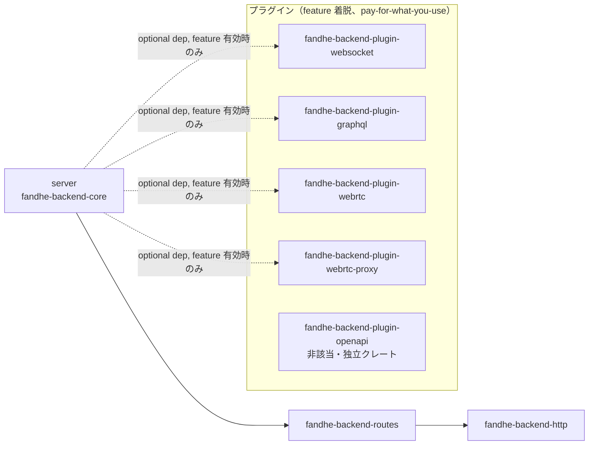

# 依存グラフ・契約ドキュメント（TASK-13.2 / #50）

`docs/spec/04-requirements.md` REQ-13「変更影響範囲の機械判定構造」の受け入れ基準
(1) 新規プロトコル・機能の追加が既存 3 拡張点のいずれかに閉じるか、閉じない場合は
その理由が設計文書に明記される、(2) モジュール境界・依存方向が `lib.rs` 等の doc
コメントで機械可読に明示されている、の 2 点を満たすための**正準ドキュメント**。

TASK-13.1（#49）は拡張点への変更影響範囲閉包を実例（WebSocket / GraphQL / WebRTC）
で検証し（`docs/design/extension-closure-verification.md`）、判定エンジン
（`scripts/extension-closure-check.sh`）を確立した。本書はその 7 節で挙げられた
引き継ぎ事項（doc コメントでの機械可読化・CI 常設運用の確立）を消化する。

## 1. 正準依存グラフ

workspace の依存方向は `server → routes → http::*` の一方向を基本とし、これに
プラグインの依存逆転エッジ（コンパイル時 `optional = true` + `dep:` 構文による
feature 着脱）が加わる。

**この依存グラフの唯一の正（機械検証ソース）は
`scripts/dep-direction-check.sh` の `allowed_edge_patterns` 配列である。**
本書の図・表はそこからの**転記**であり、二重管理を避けるため次の規約を置く。

> `allowed_edge_patterns` を変更する PR は、同一 PR 内で本書 1 節の図・表も
> 追随更新すること。乖離を検知する機械検証は現時点では未整備であり
> （8 節「スコープ外」参照）、レビューでの確認に依存する。

### 1.1 依存グラフ図



- 実線（`server → routes → http::*`）: 常時有効な一方向コア依存。循環なし
- 破線（`server -.-> fandhe-backend-plugin-*`）: feature 無効時は `cargo tree` に一切現れない
  （pay-for-what-you-use、`.claude/rules/pay-for-what-you-use.md`）コンパイル時依存逆転
- `fandhe-backend-plugin-openapi` はいずれのプラグイン依存逆転エッジにも乗らない独立クレート
  （5 節参照。現状 core / http / routes / 他プラグインのいずれからも参照されない）

### 1.2 許可エッジ一覧（`allowed_edge_patterns` からの転記）

| from | to | 種別 |
|---|---|---|
| `fandhe-backend-core` | `fandhe-backend-http` | コア一方向依存 |
| `fandhe-backend-core` | `fandhe-backend-routes` | コア一方向依存 |
| `fandhe-backend-core` | `fandhe-backend-plugin-webrtc-proxy` | プラグイン依存逆転（パスインターセプト型） |
| `fandhe-backend-core` | `fandhe-backend-plugin-webrtc` | プラグイン依存逆転（パスインターセプト型） |
| `fandhe-backend-core` | `fandhe-backend-plugin-websocket` | プラグイン依存逆転（Upgrade 型） |
| `fandhe-backend-core` | `fandhe-backend-plugin-graphql` | プラグイン依存逆転（パスインターセプト型） |
| `fandhe-backend-routes` | `fandhe-backend-http` | コア一方向依存 |
| `fandhe-backend-plugin-*` | `fandhe-backend-http` | プラグイン→コア基盤層参照（許可） |
| `fandhe-backend-plugin-*` | `fandhe-backend-routes` | プラグイン→コア基盤層参照（許可） |
| `fandhe-backend-plugin-*` | `fandhe-backend-core` | 汎用パターン（現状 `fandhe-backend-plugin-websocket` は循環回避のため不使用） |

上記以外のエッジ（逆方向・未許可のプラグイン依存等）は `dep-direction-check.sh`
チェック 1 が非 0 終了で検出する。循環依存は同スクリプト内 DFS で別途検出する
（多層防御）。

## 2. 契約一覧（拡張点・シームと実装クレートの対応）

`docs/design/plugin-boundary.md` 3〜5 節が定義する拡張点・シームの契約を、
実装クレート対応表として集約する。

| # | 拡張点 / シーム | trait / シグネチャ | dyn 互換性 | 同期/非同期 | 実装クレート | 契約・前提条件 |
|---|---|---|---|---|---|---|
| 1 | `Middleware` | `crates/core/src/extension.rs` | dyn 互換 | 同期 | （現状該当実装なし、将来用） | リクエスト前後処理への割り込み |
| 2 | `UpgradeHandler` | 同上（`try_handle_upgrade`） | dyn 互換 | 同期（委譲判定のみ）+ 実処理は非同期委譲 | `fandhe-backend-plugin-websocket` | 「委譲判定のみ」を担い、ハンドシェイク検証・101 応答送出・フレーミングはプラグイン側に閉じる契約（REQ-4） |
| 3 | `RequestGate` | 同上 | dyn 互換 | 同期 | （現状該当実装なし、将来用） | リクエスト可否判定 |
| 4 | `try_intercept`（固定シーム） | `crates/core/src/plugin.rs` | — | 非同期 | `fandhe-backend-plugin-graphql`・`fandhe-backend-plugin-webrtc`・`fandhe-backend-plugin-webrtc-proxy` | 3 trait はいずれも dyn 互換性のため同期 API 限定であり、非同期の上流中継・クエリ実行を要するプラグインは既存拡張点経由の依存逆転で表現できない（`dep-direction-check.sh` 該当コメント）。パスインターセプト型は cfg-gated 分岐として `try_intercept` に集約され、`Option` フォールスルーで次のプラグインへ委譲する（`docs/design/plugin-boundary.md` 4 節） |

3 拡張点 trait（`Middleware` / `UpgradeHandler` / `RequestGate`）+ `try_intercept`
固定シームの計 4 つが「変更影響範囲を機械判定できる閉じたシーム」の全体集合である
（`docs/design/extension-closure-verification.md` 3.4 節）。

## 3. 機械可読宣言の規約

### 3.1 形式

各 `crates/plugin-*/src/lib.rs` の冒頭 doc（`//!`、モジュール要約行の直後）に、
次の統一形式 1 行を必ず含める。

```
//! 拡張点対応: <値>
```

### 3.2 許可語彙

| 値 | 適用クレート | 補足 |
|---|---|---|
| `UpgradeHandler（try_handle_upgrade）` | `fandhe-backend-plugin-websocket` | Upgrade 型シーム |
| `パスインターセプト型（try_intercept）` | `fandhe-backend-plugin-graphql`・`fandhe-backend-plugin-webrtc`・`fandhe-backend-plugin-webrtc-proxy` | 3 trait 非該当だがシグネチャ固定シームに閉じる。宣言直後に `docs/design/extension-closure-verification.md` 3.4 節への参照を必須とする |
| `Middleware` | （現状該当なし、将来用） | 新規実装時にこの語彙で宣言する |
| `RequestGate` | （現状該当なし、将来用） | 同上 |
| `非該当（<理由の参照: docs/design/*.md>）` | `fandhe-backend-plugin-openapi` | ビルド時生成でランタイム拡張点を使わない。理由の実体は本書 5 節。参照先ファイルの存在を機械検査する |

`core` / `http` / `routes` / `axum-ref` は本宣言の対象外とする（プラグイン境界の
宣言であるため）。これらは既存の依存方向宣言（`server → routes → http::*`、
`dep-direction-check.sh` チェック 2）で機械検証済み。

### 3.3 検査手段

- `scripts/accept/req13-change-impact-accept.sh` 基準 B が、`crates/plugin-*/src/lib.rs`
  全件について宣言の存在・語彙のホワイトリスト適合・非該当/パスインターセプト型宣言の
  参照先ファイル存在を機械検査する（4 節参照）
- 新規プラグイン追加時は、当該クレートの `src/lib.rs` に本宣言を含めることを
  レビューで確認する（機械検査は基準 B が担うため、レビューは宣言の**妥当性**
  ＝実装が宣言どおりの拡張点に閉じているかを見る）

## 4. 非該当時の理由明記運用（新規プロトコル・機能追加が拡張点に閉じない場合）

REQ-13 受け入れ基準「新規プロトコル・機能の追加が既存 3 拡張点のいずれかに閉じるか、
閉じない場合はその理由が設計文書に明記される」を、機械的に強制する PR ゲートとして
`scripts/extension-closure-gate.sh` を運用する。

### 4.1 運用手順

1. `crates/plugin-*` または `crates/core/src/plugin.rs` を変更する PR は、CI 上で
   `scripts/extension-closure-gate.sh --base origin/${{ github.base_ref }}`
   が自動実行される（`.github/workflows/ci.yml` `unsafe-triage` ジョブ）
2. 変更ファイルが `scripts/extension-closure-check.sh` の A〜D カテゴリに全て
   収まる場合、ゲートは PASS する
3. E（閉包違反候補）ファイルが 1 件でもある場合、**同一 PR 内で `docs/design/`
   配下のいずれかの設計文書に当該ファイルパスを含む理由記載を追加**しない限り
   CI は FAIL する
4. 理由記載がある場合、ゲートは「理由明記済み逸脱」として WARN 付き PASS とする

### 4.2 記載様式

E ファイルの理由記載は、`docs/design/` 配下の設計文書（新規または既存）に次の
4 項目を含める（`docs/design/extension-closure-verification.md` 3.2 節を実例とする）。

1. **対象コミット/PR**: 当該変更の PR 番号・merge commit sha
2. **E ファイルパス**: 閉包の外に出たファイルの相対パス
3. **閉じない理由**: なぜ A〜D のいずれにも収まらなかったか
4. **正当性根拠**: プラグイン実装ロジックの漏出でないことの説明・依存方向への影響有無

### 4.3 記載例（TASK-10.6 / #90 / PR #156）

`crates/plugin-tracing` にバックプレッシャー・ログ欠落率計測用の doc test 例
（`examples/backpressure_probe.rs`）とテスト（`tests/backpressure.rs`）を追加した
変更で、`extension-closure-check.sh` の分類規則（`benches/**` は D「ドキュメント・
運用」の `docs/*`・`scripts/*` glob に該当せず E 判定になる）に基づき、以下 2 件が
E（閉包違反候補）と判定された。

1. **対象コミット/PR**: PR #156（#90、HEAD sha `aa326f1d6dec8523c0b4383a56631cebeaaa41ad`）
2. **E ファイルパス**:
   - `benches/reports/task-10.6-tracing-backpressure.md`
   - `benches/tracing-backpressure-bench.sh`
3. **閉じない理由**: いずれも `benches/` 配下の計測ハーネス・実測レポートであり、
   `extension-closure-check.sh` の分類規則が D として明示的に許可するのは
   `docs/*`・`scripts/*` 等の glob のみで `benches/*` は含まれないため、機械的に
   A〜D いずれにも一致せず E（閉包違反候補）に分類される
4. **正当性根拠**: 両ファイルは `crates/plugin-tracing` の実装ロジック（拡張点
   `Middleware` 経由の非同期バッファ済み I/O、5 節参照ではなく本書 2 節契約一覧の
   `Middleware` 行）そのものを変更するものではなく、既存構成（既定 lossy=true の
   `tracing_appender::non_blocking`）の高負荷時ログ欠落率を計測するベンチスクリプト
   （`benches/tracing-backpressure-bench.sh`）とその実測結果レポート
   （`benches/reports/task-10.6-tracing-backpressure.md`）に過ぎない。計測対象の
   拡張点契約（`Middleware`）・依存方向（`server → routes → http::*`、1 節）には
   一切影響しない。`benches/README.md`（同一 PR で追加、A〜D の D に該当し PASS 済み）
   に運用手順を記載済みであり、`benches/` 配下のベンチ追加が閉包違反候補となる本件は
   `extension-closure-check.sh` の分類規則が `benches/*` を D に含めていないことに
   起因する運用上のギャップであって、拡張点設計の閉包漏れではない
   （`.claude/rules/out-of-scope-tracking.md` 対象として、`extension-closure-check.sh`
   の D カテゴリに `benches/*` を追加する是正は別 Issue で扱う）

### 4.4 記載例（TASK-10.4 / #59 / PR #159）

`crates/plugin-tracing` の `tracing` feature 有効時における `GET /health` の
NFR（RPS 比・p95 比、REQ-10）再検証で、サンプリング（TASK-10.2）・イベント統合
（TASK-10.2）・高頻度パス除外（TASK-10.3）を全適用した構成が受け入れ帯に収まることを
計測するハーネス・計測対象サーバ実装・実測レポートを追加した変更で、4.3 節と同様の
理由（`extension-closure-check.sh` の分類規則が D として許可するのは `docs/*`・
`scripts/*` 等の glob のみで `benches/*` や `crates/core/examples/*` は対象外）により、
以下 4 件が E（閉包違反候補）と判定された。

1. **対象コミット/PR**: PR #159（#59、HEAD sha `c5330e4ee4f15b833d3211532baf5ad834c76b7c`）
2. **E ファイルパス**:
   - `benches/reports/task-10.4-tracing-performance.md`
   - `benches/tracing-nfr-bench.sh`
   - `crates/core/examples/minimal.rs`
   - `crates/core/examples/tracing_nfr.rs`
3. **閉じない理由**:
   - `benches/tracing-nfr-bench.sh`・`benches/reports/task-10.4-tracing-performance.md` は
     4.3 節と同一の運用上のギャップ（`benches/*` が D 未対応）により E 判定となる、
     計測ハーネスと実測結果レポートである
   - `crates/core/examples/minimal.rs`・`crates/core/examples/tracing_nfr.rs` は
     `crates/core` 配下だが `examples/*` であり `extension-closure-check.sh` の
     A（プラグインクレート内）は `crates/plugin-*` を対象、B（コア側許容シーム）は
     `crates/core/src/plugin.rs` 等の拡張点シーム本体を対象とするため、いずれにも
     一致せず E 判定となる
4. **正当性根拠**:
   - `benches/tracing-nfr-bench.sh`・`benches/reports/task-10.4-tracing-performance.md`
     は `fandhe-backend-plugin-tracing` の実装ロジック（拡張点 `Middleware`、2 節契約一覧の
     `Middleware` 行）そのものを変更せず、既存構成の NFR を計測・記録するのみで、
     計測対象の拡張点契約・依存方向（`server → routes → http::*`、1 節）には影響しない
   - `crates/core/examples/minimal.rs` は既存の負荷計測対象サンプルに `GET /health`
     ルートを追加したのみで、コアの拡張点（`Middleware` / `UpgradeHandler` /
     `RequestGate`）や `crates/core` の公開 API 契約を変更しない（既存 `GET /` は無変更、
     他 NFR ベンチへの影響なしを実測確認済み、PR #159 本文参照）
   - `crates/core/examples/tracing_nfr.rs` は新規追加だが、`tracing` feature 経由で
     `Server::tracing` を呼び出すだけの計測対象サーバであり、`Middleware` 拡張点の
     契約自体（`crates/plugin-tracing` 側の実装）は変更しない。`crates/core/Cargo.toml`
     の `required-features = ["tracing"]` によって `tracing` feature 無効時にはビルド
     対象外となり、pay-for-what-you-use 原則（`.claude/rules/pay-for-what-you-use.md`）
     にも抵触しない
   - 4 件とも `crates/plugin-tracing` の実装ロジックの漏出ではなく、既存拡張点契約を
     計測・実証する周辺資産に留まる。`benches/*` を D カテゴリに追加する是正は 4.3 節と
     同一の別 Issue 対象とし、`crates/core/examples/*` の扱いについても
     `extension-closure-check.sh` の分類規則見直しの要否を含め
     `.claude/rules/out-of-scope-tracking.md` 対象として同一の是正検討に含める

### 4.5 記載例（TASK-9.3 / #63 / PR #161）

`crates/plugin-hub-wiring` の `RequestGate` 拡張点実装（`TenantGate::check`）が
`verify_token`（RS256 署名検証）を毎回呼び出していた重複を、`Authenticator` による
リクエストスコープの検証結果キャッシュで解消した変更で、4.3 節・4.4 節と同一の理由
（`extension-closure-check.sh` の分類規則が D として許可するのは `docs/*`・`scripts/*`
等の glob のみで `benches/*` は対象外）により、以下 1 件が E（閉包違反候補）と判定された。

1. **対象コミット/PR**: PR #161（#63、HEAD sha `5e0a81db8991f9dd0d07b0e08f464e21e246b1fc`）
2. **E ファイルパス**:
   - `benches/reports/task-9.3-jwt-cache-performance.md`
3. **閉じない理由**: 4.3 節・4.4 節と同一の運用上のギャップ（`benches/*` が D 未対応）
   により E 判定となる、キャッシュ導入前後のコスト比較（RS256 署名検証の重複解消）を
   記録した実測レポートである。なお同一変更で追加した計測ハーネス本体
   （`crates/plugin-hub-wiring/examples/jwt_cache_bench.rs`）はプラグインクレート内
   （A）に該当し PASS 済みで、E 判定はレポート md ファイルのみ
4. **正当性根拠**: 本レポートは `fandhe-backend-plugin-hub-wiring` の `RequestGate` 実装
   （`TenantGate::check`、2 節契約一覧の `RequestGate` 行）そのものの契約を変更する
   ものではなく、検証結果キャッシュ導入によるレイテンシ・スループット改善を計測・記録
   するのみで、拡張点契約・依存方向（`server → routes → http::*`、1 節）には影響しない。
   `Authenticator` はキャッシュ未ヒット時に必ず `verify_token` へフェイルクローズで
   委譲し（鍵ローテーション・`exp` は都度再判定）、`GateOutcome` が判定結果のみを運ぶ
   契約（`crates/core/src/extension.rs` doc）も変更していない。`benches/*` を D
   カテゴリに追加する是正は 4.3 節・4.4 節と同一の別 Issue 対象とする

### 4.6 記載例（TASK-9.5 / #65 / PR #163）

`crates/plugin-hub-wiring` の `RequestGate` 拡張点実装（`TenantGate`）をリンクした
hub サービス（`examples/hub_service_demo.rs`）が、無関係パス（`GET /`）への
RPS・p95 レイテンシに与える影響（NFR-6、`docs/spec/04-requirements.md`）を、
ベースライン（`examples/minimal`）との比較で実測した変更で、4.3 節〜4.5 節と同一の
理由（`extension-closure-check.sh` の分類規則が D として許可するのは `docs/*`・
`scripts/*` 等の glob のみで `benches/*` は対象外）により、以下 2 件が E（閉包違反候補）
と判定された。

1. **対象コミット/PR**: PR #163（#65、HEAD sha `aad82ce29a745a6195e43157112d17d0ceeadd09`）
2. **E ファイルパス**:
   - `benches/hub-nfr6-bench.sh`
   - `benches/reports/task-9.5-hub-wiring-performance.md`
3. **閉じない理由**: 4.3 節〜4.5 節と同一の運用上のギャップ（`benches/*` が D 未対応）
   により E 判定となる、`fandhe-backend-plugin-hub-wiring` リンクコスト・opt-in（ゲート有効時）
   コストを計測するベンチスクリプトとその実測結果レポートである
   （`benches/graphql-nfr6-bench.sh`・`benches/webrtc-nfr6-bench.sh` と同型、
   `benches/hub-nfr6-bench.sh` 冒頭コメント参照）
4. **正当性根拠**: 両ファイルは `fandhe-backend-plugin-hub-wiring` の `RequestGate` 実装
   （`TenantGate`、2 節契約一覧の `RequestGate` 行）そのものの契約を変更するもの
   ではなく、既存構成（`BF_HUB_GATE=off` によるリンクコスト分離計測、および
   ゲート有効構成の opt-in コスト参考値）の負荷計測・実測結果を記録するのみで、
   計測対象の拡張点契約・依存方向（`server → routes → http::*`、1 節）には一切
   影響しない。計測は既存バイナリ（`examples/minimal`・`examples/hub_service_demo`）
   に対する外部負荷生成（`oha`）であり、`GateOutcome` が判定結果のみを運ぶ契約
   （`crates/core/src/extension.rs` doc）も変更していない。`benches/*` を D
   カテゴリに追加する是正は 4.3 節〜4.5 節と同一の別 Issue 対象とする

### 4.7 記載例（TASK-176 / #176 / PR #191）

`fandhe-backend-routes`（`crates/routes`）の `Router` に `{name}` パスパラメータ対応
（`route_param` / `dispatch` の優先順位付き解決、`PathParams` によるゼロコピー
値抽出）を追加した変更で、`extension-closure-check.sh` の分類規則（A はプラグイン
クレート内 `crates/plugin-*/**`、B はコア側許容シームのうち `crates/core/Cargo.toml`・
`crates/core/src/plugin.rs`・`crates/core/src/server.rs`・`crates/core/src/lib.rs`
のみ、C はテストのうち `crates/core/tests/**` と `crates/plugin-*/tests/**` のみ）が
`crates/routes/**` を A〜D いずれにも含めていないため、以下 3 件が E（閉包違反候補）
と判定された。

1. **対象コミット/PR**: PR #191（#176、コンテンツ確定コミット sha
   `5381b85bf75e68d49aac8cb5b3be1e88b8812e26`）
2. **E ファイルパス**:
   - `crates/routes/src/lib.rs`
   - `crates/routes/src/pattern.rs`
   - `crates/routes/tests/path_params.rs`
3. **閉じない理由**: `extension-closure-check.sh` の分類規則は「プラグインクレート内
   （A）」「コア側許容シーム（B、`crates/core` の 4 ファイルのみ）」「テスト（C、
   `crates/core/tests/**`・`crates/plugin-*/tests/**` のみ）」「ドキュメント・運用
   （D、`docs/*`・`scripts/*` 等）」の 4 カテゴリしか許可しておらず、`fandhe-backend-routes`
   （1 節の正準依存グラフにおける中間層クレート、`server → routes → http::*`）を
   走査対象に含めていない。今回の変更は 3 拡張点 trait（`Middleware` /
   `UpgradeHandler` / `RequestGate`）にも `try_intercept` 固定シームにも一切触れて
   おらず、いずれのプラグインクレート（`crates/plugin-*`）でもない `fandhe-backend-routes` 自体の
   ルーティング機能拡張であるため、分類規則の対象漏れにより機械的に A〜D いずれにも
   一致せず E 判定となる
4. **正当性根拠**: 3 ファイルはいずれも `fandhe-backend-routes` の既存責務（method + `target` の
   完全一致解決）に `{name}` パラメータ照合を追加するのみで、2 節契約一覧の 4 拡張点
   （`Middleware`・`UpgradeHandler`・`RequestGate`・`try_intercept`）のいずれの実装
   クレート（`fandhe-backend-plugin-websocket`・`fandhe-backend-plugin-graphql`・`fandhe-backend-plugin-webrtc`・
   `fandhe-backend-plugin-webrtc-proxy`）にも属さず、それらの契約・シグネチャを変更しない。
   依存方向（`server → routes → http::*`、1 節）も維持したまま
   （`crates/routes/src/pattern.rs` は `fandhe-backend-http` の型に依存しない旨を冒頭 doc に明記、
   `crates/routes/src/lib.rs` 冒頭 doc の依存方向宣言も無変更）であり、
   `crates/plugin-*` 固有シンボルへの依存も追加していない
   （`scripts/dep-direction-check.sh` で検証可能）。既存の静的ルート（完全一致）の
   ヒット経路・ハッシュマップルックアップは無変更で後方互換を維持し
   （`crates/routes/src/lib.rs` 冒頭 doc「マッチング方針」節）、`crates/routes/tests/
   path_params.rs` は追加した `route_param` / `dispatch` の振る舞いを検証するテスト
   に過ぎない。したがって本件は拡張点設計の閉包漏れ（プラグイン実装ロジックの拡張点
   外への漏出）ではなく、`extension-closure-check.sh` の分類規則が中間層クレート
   `fandhe-backend-routes` を A〜D のいずれにも割り当てていない運用上のギャップに起因する。
   `fandhe-backend-routes`（コア一方向依存の中間層、B 相当の許容シームへの追加）を分類規則に
   含める是正は 4.3 節〜4.6 節と同一の別 Issue 対象とする
   （`.claude/rules/out-of-scope-tracking.md`）

### 4.8 記載例（TASK-4.4 / #179 / PR #194）

`crates/plugin-websocket` にユーザー定義 WebSocket メッセージハンドラ API
（`WsMessageHandler`・`WebSocketConfig::with_handler`、既定は `EchoHandler` で
後方互換維持）を追加した変更で、TASK-4.3（#24、PR #164）で追加済みの計測専用
example（`crates/core/examples/ws_echo.rs`）の doc comment を、新 API の関数名
（`run_session`）・既定ハンドラ（`EchoHandler`）に追随させて更新した。この 1 行の
doc comment 更新のみが同一 PR の差分に含まれたため、4.4 節と同一の理由
（`extension-closure-check.sh` の A（プラグインクレート内）は `crates/plugin-*` を
対象、B（コア側許容シーム）は `crates/core/src/plugin.rs` 等の拡張点シーム本体を
対象とし、`crates/core/examples/*` はいずれにも一致しない）により、以下 1 件が
E（閉包違反候補）と判定された。

1. **対象コミット/PR**: PR #194（#179、fmt/clippy 是正コミットにて本節を追記）
2. **E ファイルパス**:
   - `crates/core/examples/ws_echo.rs`
3. **閉じない理由**: 4.4 節と同一の運用上のギャップ（`crates/core/examples/*` が
   A・B いずれにも該当しない）により E 判定となる。当該ファイルは TASK-4.3（#24）で
   既に E 判定・4.4 節の記載対象として運用上受理済みの計測専用サーバであり、本 PR
   では `crates/plugin-websocket/src/session.rs` の関数リネーム（`run_echo_session`
   → `run_session`）・既定ハンドラ導入（`EchoHandler`）に追随して doc comment の
   参照名を更新したのみである
4. **正当性根拠**: 変更は doc comment（コメント文字列）のみであり、
   `crates/core/examples/ws_echo.rs` が呼び出す `fandhe_backend_plugin_websocket::WebSocketConfig`
   の公開 API・`Server::websocket` の配線・拡張点契約（`UpgradeHandler`、2 節契約
   一覧）を一切変更しない。参照先の実装（`run_session` への改名・`WsMessageHandler`
   拡張、既定は `EchoHandler` で従来の `run_echo_session` と同一の観測可能な挙動を
   維持）は `crates/plugin-websocket` 側のみで完結しており、コアの依存方向
   （`server → routes → http::*`、1 節）には影響しない。4.4 節で既に受理済みの
   `crates/core/examples/*` の扱い見直し（分類規則の是正）は同節と同一の別 Issue
   対象のまま据え置く

## 5. `fandhe-backend-plugin-openapi` の非該当理由

`fandhe-backend-plugin-openapi` は 3 拡張点 trait・`try_intercept` 固定シームのいずれも
使わない。ビルド時（`gen-openapi` CLI、TASK-3.2 / #31）に `openapi.json` を静的生成し、
実行時は生成済み JSON を配信するのみで、コアのリクエスト処理ループへ動的に割り込む
ランタイム拡張点を要さないためである（`crates/plugin-openapi/src/lib.rs` 冒頭 doc・
`docs/spec/03-poc/openapi-generation/README.md`）。

コアとの接続（`GET /openapi.json` の配線）は TASK-2.1（#18）のサーバ側 feature
（`openapi = ["dep:fandhe-backend-plugin-openapi"]` 相当）に委ねられ、これはコンパイル時の
feature 着脱であって実行時拡張点の契約ではない。したがって「3 拡張点のいずれかに
閉じるか、閉じない場合は理由を明記する」という REQ-13 の要求に対しては、
「拡張点自体を使用しない（非該当）」区分として扱い、本節をその理由の実体とする。

## 6. 検証コマンド

```bash
# 依存方向一方向性（1 節の正準グラフの機械検証ソース）
bash scripts/dep-direction-check.sh

# 拡張点閉包判定エンジン単体
bash scripts/extension-closure-check.sh --commit <sha>

# PR ゲート（4 節の運用の実装）
bash scripts/extension-closure-gate.sh --base origin/main

# REQ-13 受け入れテスト一式（本書 2〜5 節の内容を検証）
bash scripts/accept/req13-change-impact-accept.sh
```

## 7. スコープ外（`.claude/rules/out-of-scope-tracking.md` 対象、ユーザー承認前提）

- `crates/http/src/response.rs` の `reason_phrase` テーブル設計見直し
  （`docs/design/extension-closure-verification.md` 8 節で提案済みの是正候補）
- `Middleware` / `RequestGate` を使う新規実例の追加実装（hub-wiring 等、別マイルストーン）
- `dep-direction-check.sh` の `allowed_edge_patterns` を本書 1 節から自動生成する仕組み
  （二重管理解消の深掘り）
