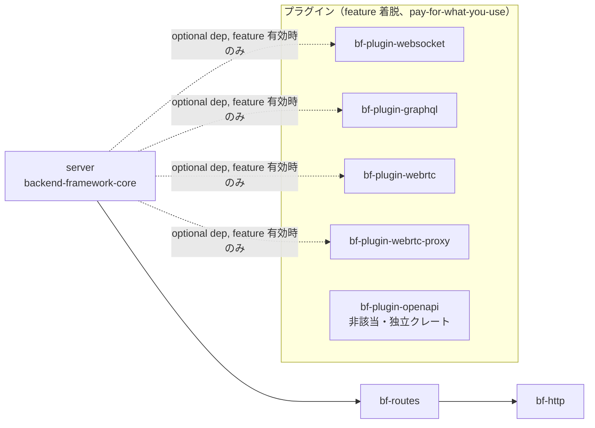

# 依存グラフ・契約ドキュメント（TASK-13.2 / #50）

`docs/spec/04-requirements.md` REQ-13「変更影響範囲の機械判定構造」の受け入れ基準
(1) 新規プロトコル・機能の追加が既存 3 拡張点のいずれかに閉じるか、閉じない場合は
その理由が設計文書に明記される、(2) モジュール境界・依存方向が `lib.rs` 等の doc
コメントで機械可読に明示されている、の 2 点を満たすための**正準ドキュメント**。

TASK-13.1（#49）は拡張点への変更影響範囲閉包を実例（WebSocket / GraphQL / WebRTC）
で検証し（`docs/design/extension-closure-verification.md`）、判定エンジン
（`scripts/extension-closure-check.sh`）を確立した。本書はその 7 節で挙げられた
引き継ぎ事項（doc コメントでの機械可読化・CI 常設運用の確立）を消化する。

## 1. 正準依存グラフ

workspace の依存方向は `server → routes → http::*` の一方向を基本とし、これに
プラグインの依存逆転エッジ（コンパイル時 `optional = true` + `dep:` 構文による
feature 着脱）が加わる。

**この依存グラフの唯一の正（機械検証ソース）は
`scripts/dep-direction-check.sh` の `allowed_edge_patterns` 配列である。**
本書の図・表はそこからの**転記**であり、二重管理を避けるため次の規約を置く。

> `allowed_edge_patterns` を変更する PR は、同一 PR 内で本書 1 節の図・表も
> 追随更新すること。乖離を検知する機械検証は現時点では未整備であり
> （8 節「スコープ外」参照）、レビューでの確認に依存する。

### 1.1 依存グラフ図



- 実線（`server → routes → http::*`）: 常時有効な一方向コア依存。循環なし
- 破線（`server -.-> bf-plugin-*`）: feature 無効時は `cargo tree` に一切現れない
  （pay-for-what-you-use、`.claude/rules/pay-for-what-you-use.md`）コンパイル時依存逆転
- `bf-plugin-openapi` はいずれのプラグイン依存逆転エッジにも乗らない独立クレート
  （5 節参照。現状 core / http / routes / 他プラグインのいずれからも参照されない）

### 1.2 許可エッジ一覧（`allowed_edge_patterns` からの転記）

| from | to | 種別 |
|---|---|---|
| `backend-framework-core` | `bf-http` | コア一方向依存 |
| `backend-framework-core` | `bf-routes` | コア一方向依存 |
| `backend-framework-core` | `bf-plugin-webrtc-proxy` | プラグイン依存逆転（パスインターセプト型） |
| `backend-framework-core` | `bf-plugin-webrtc` | プラグイン依存逆転（パスインターセプト型） |
| `backend-framework-core` | `bf-plugin-websocket` | プラグイン依存逆転（Upgrade 型） |
| `backend-framework-core` | `bf-plugin-graphql` | プラグイン依存逆転（パスインターセプト型） |
| `bf-routes` | `bf-http` | コア一方向依存 |
| `bf-plugin-*` | `bf-http` | プラグイン→コア基盤層参照（許可） |
| `bf-plugin-*` | `bf-routes` | プラグイン→コア基盤層参照（許可） |
| `bf-plugin-*` | `backend-framework-core` | 汎用パターン（現状 `bf-plugin-websocket` は循環回避のため不使用） |

上記以外のエッジ（逆方向・未許可のプラグイン依存等）は `dep-direction-check.sh`
チェック 1 が非 0 終了で検出する。循環依存は同スクリプト内 DFS で別途検出する
（多層防御）。

## 2. 契約一覧（拡張点・シームと実装クレートの対応）

`docs/design/plugin-boundary.md` 3〜5 節が定義する拡張点・シームの契約を、
実装クレート対応表として集約する。

| # | 拡張点 / シーム | trait / シグネチャ | dyn 互換性 | 同期/非同期 | 実装クレート | 契約・前提条件 |
|---|---|---|---|---|---|---|
| 1 | `Middleware` | `crates/core/src/extension.rs` | dyn 互換 | 同期 | （現状該当実装なし、将来用） | リクエスト前後処理への割り込み |
| 2 | `UpgradeHandler` | 同上（`try_handle_upgrade`） | dyn 互換 | 同期（委譲判定のみ）+ 実処理は非同期委譲 | `bf-plugin-websocket` | 「委譲判定のみ」を担い、ハンドシェイク検証・101 応答送出・フレーミングはプラグイン側に閉じる契約（REQ-4） |
| 3 | `RequestGate` | 同上 | dyn 互換 | 同期 | （現状該当実装なし、将来用） | リクエスト可否判定 |
| 4 | `try_intercept`（固定シーム） | `crates/core/src/plugin.rs` | — | 非同期 | `bf-plugin-graphql`・`bf-plugin-webrtc`・`bf-plugin-webrtc-proxy` | 3 trait はいずれも dyn 互換性のため同期 API 限定であり、非同期の上流中継・クエリ実行を要するプラグインは既存拡張点経由の依存逆転で表現できない（`dep-direction-check.sh` 該当コメント）。パスインターセプト型は cfg-gated 分岐として `try_intercept` に集約され、`Option` フォールスルーで次のプラグインへ委譲する（`docs/design/plugin-boundary.md` 4 節） |

3 拡張点 trait（`Middleware` / `UpgradeHandler` / `RequestGate`）+ `try_intercept`
固定シームの計 4 つが「変更影響範囲を機械判定できる閉じたシーム」の全体集合である
（`docs/design/extension-closure-verification.md` 3.4 節）。

## 3. 機械可読宣言の規約

### 3.1 形式

各 `crates/plugin-*/src/lib.rs` の冒頭 doc（`//!`、モジュール要約行の直後）に、
次の統一形式 1 行を必ず含める。

```
//! 拡張点対応: <値>
```

### 3.2 許可語彙

| 値 | 適用クレート | 補足 |
|---|---|---|
| `UpgradeHandler（try_handle_upgrade）` | `bf-plugin-websocket` | Upgrade 型シーム |
| `パスインターセプト型（try_intercept）` | `bf-plugin-graphql`・`bf-plugin-webrtc`・`bf-plugin-webrtc-proxy` | 3 trait 非該当だがシグネチャ固定シームに閉じる。宣言直後に `docs/design/extension-closure-verification.md` 3.4 節への参照を必須とする |
| `Middleware` | （現状該当なし、将来用） | 新規実装時にこの語彙で宣言する |
| `RequestGate` | （現状該当なし、将来用） | 同上 |
| `非該当（<理由の参照: docs/design/*.md>）` | `bf-plugin-openapi` | ビルド時生成でランタイム拡張点を使わない。理由の実体は本書 5 節。参照先ファイルの存在を機械検査する |

`core` / `http` / `routes` / `axum-ref` は本宣言の対象外とする（プラグイン境界の
宣言であるため）。これらは既存の依存方向宣言（`server → routes → http::*`、
`dep-direction-check.sh` チェック 2）で機械検証済み。

### 3.3 検査手段

- `scripts/accept/req13-change-impact-accept.sh` 基準 B が、`crates/plugin-*/src/lib.rs`
  全件について宣言の存在・語彙のホワイトリスト適合・非該当/パスインターセプト型宣言の
  参照先ファイル存在を機械検査する（4 節参照）
- 新規プラグイン追加時は、当該クレートの `src/lib.rs` に本宣言を含めることを
  レビューで確認する（機械検査は基準 B が担うため、レビューは宣言の**妥当性**
  ＝実装が宣言どおりの拡張点に閉じているかを見る）

## 4. 非該当時の理由明記運用（新規プロトコル・機能追加が拡張点に閉じない場合）

REQ-13 受け入れ基準「新規プロトコル・機能の追加が既存 3 拡張点のいずれかに閉じるか、
閉じない場合はその理由が設計文書に明記される」を、機械的に強制する PR ゲートとして
`scripts/extension-closure-gate.sh` を運用する。

### 4.1 運用手順

1. `crates/plugin-*` または `crates/core/src/plugin.rs` を変更する PR は、CI 上で
   `scripts/extension-closure-gate.sh --base origin/${{ github.base_ref }}`
   が自動実行される（`.github/workflows/ci.yml` `unsafe-triage` ジョブ）
2. 変更ファイルが `scripts/extension-closure-check.sh` の A〜D カテゴリに全て
   収まる場合、ゲートは PASS する
3. E（閉包違反候補）ファイルが 1 件でもある場合、**同一 PR 内で `docs/design/`
   配下のいずれかの設計文書に当該ファイルパスを含む理由記載を追加**しない限り
   CI は FAIL する
4. 理由記載がある場合、ゲートは「理由明記済み逸脱」として WARN 付き PASS とする

### 4.2 記載様式

E ファイルの理由記載は、`docs/design/` 配下の設計文書（新規または既存）に次の
4 項目を含める（`docs/design/extension-closure-verification.md` 3.2 節を実例とする）。

1. **対象コミット/PR**: 当該変更の PR 番号・merge commit sha
2. **E ファイルパス**: 閉包の外に出たファイルの相対パス
3. **閉じない理由**: なぜ A〜D のいずれにも収まらなかったか
4. **正当性根拠**: プラグイン実装ロジックの漏出でないことの説明・依存方向への影響有無

## 5. `bf-plugin-openapi` の非該当理由

`bf-plugin-openapi` は 3 拡張点 trait・`try_intercept` 固定シームのいずれも
使わない。ビルド時（`gen-openapi` CLI、TASK-3.2 / #31）に `openapi.json` を静的生成し、
実行時は生成済み JSON を配信するのみで、コアのリクエスト処理ループへ動的に割り込む
ランタイム拡張点を要さないためである（`crates/plugin-openapi/src/lib.rs` 冒頭 doc・
`docs/spec/03-poc/openapi-generation/README.md`）。

コアとの接続（`GET /openapi.json` の配線）は TASK-2.1（#18）のサーバ側 feature
（`openapi = ["dep:bf-plugin-openapi"]` 相当）に委ねられ、これはコンパイル時の
feature 着脱であって実行時拡張点の契約ではない。したがって「3 拡張点のいずれかに
閉じるか、閉じない場合は理由を明記する」という REQ-13 の要求に対しては、
「拡張点自体を使用しない（非該当）」区分として扱い、本節をその理由の実体とする。

## 6. 検証コマンド

```bash
# 依存方向一方向性（1 節の正準グラフの機械検証ソース）
bash scripts/dep-direction-check.sh

# 拡張点閉包判定エンジン単体
bash scripts/extension-closure-check.sh --commit <sha>

# PR ゲート（4 節の運用の実装）
bash scripts/extension-closure-gate.sh --base origin/main

# REQ-13 受け入れテスト一式（本書 2〜5 節の内容を検証）
bash scripts/accept/req13-change-impact-accept.sh
```

## 7. スコープ外（`.claude/rules/out-of-scope-tracking.md` 対象、ユーザー承認前提）

- `crates/http/src/response.rs` の `reason_phrase` テーブル設計見直し
  （`docs/design/extension-closure-verification.md` 8 節で提案済みの是正候補）
- `Middleware` / `RequestGate` を使う新規実例の追加実装（hub-wiring 等、別マイルストーン）
- `dep-direction-check.sh` の `allowed_edge_patterns` を本書 1 節から自動生成する仕組み
  （二重管理解消の深掘り）
