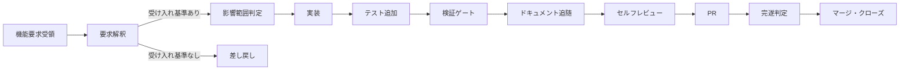
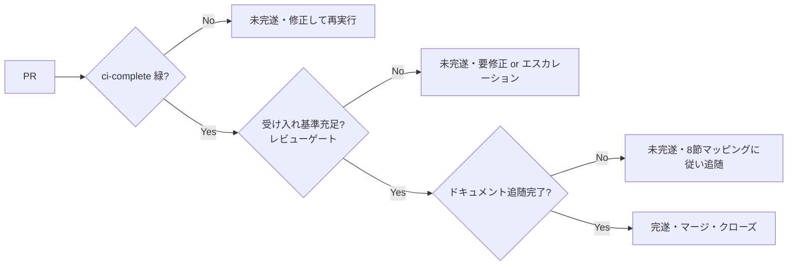

# 機能要求→実装→テスト→ドキュメント追随→完遂判定の一貫改修フロー — TASK-12.2

TASK-12.2-1（#81）+ TASK-12.2-2（#82、REQ-12(b)）の成果物。REQ-12(b)
（`docs/spec/04-requirements.md`）が要求する「受け取った機能要求を、AI が実装・テスト
追加・ドキュメント更新まで一貫して改修するフロー」の全体を扱う。親タスク TASK-12.2
（#43、`docs/spec/05-tasks.md`）は 4h 粒度で 2 サブタスクに分解されており、本書は両者を
統合した単一の改修フロードキュメントである。

- **TASK-12.2-1（#81）**: 機能要求の受付から実装・テスト追加までの基幹フロー整備
  （本書 1〜7 節）
- **TASK-12.2-2（#82）**: フローの残り 2 要素 —— **(1) ドキュメント追随**（変更に
  応じて更新すべきドキュメントの特定と更新をフローの必須ステップとして組み込む）と
  **(2) 完遂判定**（何をもって改修「完遂」とみなすかの判定基準をフローの終端ゲートとして
  組み込む）（本書 8〜9 節）

## 1. 目的・位置付け

先行 TASK-12.1（#79/#80、REQ-12(a)）で「改善提案（検知・トリアージ→提案→承認→実装）」側の
フローは
[`improvement-proposal-flow.md`](./improvement-proposal-flow.md) として整備済みである。
本書はその対となる「**外部から受け取った機能要求を起点とする改修**」フローを、同じ
成果物パターン（機構 = `scripts/`、設計書 = `docs/design/`、運用規約 = `.claude/rules/`）
で定義する。両フローの違いは起点のみである。

| フロー | 起点 | 提案・要求の生成主体 |
|--------|------|----------------------|
| 改善提案フロー（TASK-12.1） | 自動検知（audit / unsafe / 依存 / 性能） | フレームワーク自身（CI・AI エージェントの能動分析） |
| 機能改修フロー（本書、TASK-12.2） | 外部からの機能要求（Issue） | 利用者・ステークホルダー |

### 責務分界

- 機能要求 → 実装 → テスト追加の基幹フロー整備（1〜7 節）は TASK-12.2-1（#81）のスコープ。
- ドキュメント追随（8 節）・完遂判定（9 節）の組み込みは TASK-12.2-2（#82）のスコープ。
- 対応可否ガードレール（可 / 不可 / 要エスカレーション判定）は TASK-12.3（#83/#84）のスコープ。
- レビューゲート（人間承認）の運用定義は TASK-14.3（#41、未了）のスコープ。

既存の関連ドキュメントとの関係:

- CI 完遂判定の機械部分（`ci-complete` 集約ゲート）は TASK-14.1（#39）の
  [`ci-completion-criteria.md`](./ci-completion-criteria.md) が実装済み。本書はこれを
  **改修フローの完遂判定として参照・組み込む**のであって、再実装しない。
- ドキュメント追随のうち doc comment・doc test は TASK-11.2（#75/#76）で
  `missing_docs` + rustdoc lint + doc test として既に機械強制されている（CI `doc` /
  `test` ジョブ）。本書はこの既存の機械強制を 8 節の表で参照する。
- `docs/design/<flow>.md` + `.claude/rules/<flow>.md` + CLAUDE.md Rules 表更新という
  ドキュメント構成パターンは TASK-12.1-2（#80）の
  [`improvement-proposal-flow.md`](./improvement-proposal-flow.md) /
  [`.claude/rules/improvement-proposal.md`](../../.claude/rules/improvement-proposal.md) の
  体裁を踏襲する。

## 2. フロー全体像

| 段階 | 内容 | 担い手 | 本書での扱い |
|------|------|--------|-------------|
| 機能要求受領 | Issue form（`.github/ISSUE_TEMPLATE/feature-request.yml`）で受付 | 利用者・ステークホルダー | 3 節 |
| 要求解釈 | 受け入れ基準の存在確認。なければ差し戻し。曖昧要求・危険要求の可否判定（可 / 不可 / 要エスカレーション）の詳細ガードレールは [`feasibility-guardrail.md`](./feasibility-guardrail.md)（TASK-12.3-1、#83）、判定記録の機械検証は `scripts/feasibility-check.sh`（TASK-12.3-2、#84） | AI エージェント（main） | 4 節 |
| 影響範囲判定 | 3 拡張点（`Middleware` / `UpgradeHandler` / `RequestGate`）・feature 構成への閉包判定 | AI エージェント（`explorer` 等） | 5 節 |
| 実装 | パスベース委譲（[[delegation-impl]]）・pay-for-what-you-use 遵守 | `core-builder` / `plugin-builder` 等 | 6 節 |
| テスト追加 | feature 構成別 `cargo test`・doc test・`scripts/feature-flow-check.sh` による同時性チェック | `test-runner` | 6 節 |
| 検証ゲート | CI 全通過 + レビュー承認（自動マージ禁止） | 自動 CI + 人間レビュアー | 7 節 |
| **ドキュメント追随** | 変更種別に応じたドキュメントを更新 | AI エージェント | **8 節** |
| セルフレビュー | 品質・アーキテクチャ準拠・セキュリティ監査（`delegation-impl.md` の実装後標準フロー） | `reviewer` / `security-auditor` | [[delegation-impl]] |
| PR | Conventional Commits 準拠でコミット・PR 作成 | AI エージェント | [[conventional-commits]] |
| **完遂判定** | `ci-complete` + レビューゲート + ドキュメント追随の 3 条件充足を確認 | 自動 CI + 人間レビュアー | **9 節** |
| マージ・クローズ | 完遂判定通過後にマージ | 人間（マージ操作） | 9 節 |

改修の**自動適用・自動マージは行わない**（改善提案フローと同一原則、フェイルクローズ）。
実装は必ず CI 通過とレビューゲートを経る。CI 完遂判定基準の詳細は
[`ci-completion-criteria.md`](./ci-completion-criteria.md)（REQ-14）を参照。

## 3. 機能要求の受付形式

`.github/ISSUE_TEMPLATE/feature-request.yml`（ラベル `feature-request`）で受け付ける。
必須項目:

| 項目 | 内容 |
|------|------|
| 概要 | 何を実現したいか（背景・課題を含む） |
| 受け入れ基準（必須） | 実装完了とみなせる具体的条件。**空では受付を成立させない**（Issue form の `validations.required: true`） |
| 影響範囲の想定 | 対象クレート・プラグイン・feature 構成・拡張点の想定 |

任意項目: 対象クレート/feature、依存・前提（他 Issue・マイルストーンへの依存）、
安全性方針との関係（unsafe の要否・OWASP Top 10 の観点）。

## 4. 要求解釈 — 受け入れ基準なし要求の差し戻し

Issue form の `validations.required: true` は GitHub 側の入力 UI レベルでの必須化に
留まり、API 経由の起票やテンプレート外の Issue には強制力が及ばない。したがって
AI エージェントは実装着手前に受け入れ基準の記載を確認し、欠けている場合は実装に
着手せず差し戻す（`.claude/rules/feature-modification.md` の運用規約として明文化）。

**「曖昧要求・危険要求の不可判定」の詳細ガードレール（可 / 不可 / 要エスカレーションの
判定基準）は TASK-12.3（#83/#84）のスコープ**であり、本書は「受け入れ基準の有無」という
機械的に確認可能な最小条件のみを扱う。判定基準・判定記録の形式は
[`feasibility-guardrail.md`](./feasibility-guardrail.md)（TASK-12.3-1、#83）が定め、
判定記録の形式検証は `scripts/feasibility-check.sh`（TASK-12.3-2、#84）が機械化する。

## 5. 影響範囲判定

実装着手前に、要求が以下のいずれに閉じるかを判定する（[[coding-rust]] の拡張点原則に
従う）。

- 3 拡張点（`Middleware` / `UpgradeHandler` / `RequestGate`）のいずれかに載る変更か
- 特定の `crates/plugin-*` に閉じる変更か（pay-for-what-you-use、feature ゲート要否）
- コア（`crates/core` / `crates/http` / `crates/routes`）へ影響する変更か

影響範囲が広い（コア変更・複数プラグイン横断）場合は `docs/dep-impact/` の計測結果も
参照し、パスベース委譲（[[delegation-impl]]）の分岐先を確定させてから実装に進む。

## 6. 実装 — テスト追加の機械同時性チェック

REQ-12(b) の「実装・テスト追加まで一貫」を機械的に担保するため、
`scripts/feature-flow-check.sh` を新設した。

- `git diff --name-only -z <base>...<head>` で `crates/<name>/src/**/*.rs` の変更を検出
- 同一クレートに `crates/<name>/tests/**` の変更、または src 差分の追加行に
  `#[test]` / `#[tokio::test]` / `#[cfg(test)]` / doc test フェンス（`/// \`\`\``）が
  なければ **フェイルクローズ**（非 0 終了）。既存 `#[test]` 関数内のアサーションのみを
  書き換える編集も、変更箇所を囲む近傍限定コンテキスト（`-U16`）でマーカーを検知する
- `--allow-no-tests <crate> "<理由>"` で理由必須の明示的除外が可能（暗黙スキップは
  設けない。除外時も警告を出力し、レビューで人間が理由を確認する前提）

セルフテスト `scripts/tests/run-feature-flow-tests.sh` は一時 git リポジトリの fixture
で判定パターンを検証し、`.github/workflows/ci.yml` の `unsafe-triage` ジョブから実行する
（ネットワーク・cargo ビルド不要、`scripts/tests/run-triage-tests.sh` と同じ設計方針）。

**`feature-flow-check.sh` 本体を PR の必須ゲート（CI 上で実際に base/head diff を取って
失敗させる運用）として組み込む対応は未着手（今後のタスク）**とする。本タスクでは機構本体と
セルフテストの提供に留め、既存 PR フローを壊さない安全側の判断とした。

## 7. 検証ゲート

- feature 構成別 `cargo test`（`--no-default-features` / default / 各 feature 単体 /
  `--all-features`）と doc test（`cargo test --doc`）
- `cargo fmt --check` / `cargo clippy --all-features -- -D warnings`
- `scripts/feature-flow-check.sh --base origin/main`（ローカル実行。CI 必須ゲート化は
  6 節参照、未着手）
- CI 全ジョブ（`ci-complete` 集約ゲート、[`ci-completion-criteria.md`](./ci-completion-criteria.md)）green

## 8. ドキュメント追随（変更種別 → 追随ドキュメントのマッピング）

変更を「完遂」とみなすには、コード変更だけでなく対応するドキュメントの追随が必須である
（9 節の完遂判定の条件 (3)）。変更種別ごとに追随すべきドキュメントと、その追随を担保する
手段（機械強制か運用チェックリストか）を以下に整理する。

| 変更種別 | 追随すべきドキュメント | 強制手段 |
|---------|----------------------|---------|
| 公開 API 追加・変更 | doc comment + doc test（`# Examples`。[`coding-rust.md`](../../.claude/rules/coding-rust.md)・[`code-comment-style.md`](../../.claude/rules/code-comment-style.md) 準拠） | **機械**: `missing_docs` + rustdoc lint（CI `doc` ジョブ）・doc test（CI `test` ジョブ）。TASK-11.2（#75/#76）で実装済み |
| エンドポイント・拡張点追加 | AGENTS.md（TASK-2.3 でファイル自体は先行作成済み。TASK-11.3・#35 が要求する変更手順・判定基準・エスカレーション基準の明文化は「AI エージェント向け変更ガイド」節として完了） | 運用: セルフレビュー（`reviewer`）のチェック項目 |
| クレート・feature 構成変更 | CLAUDE.md の Repository Structure 節・ルート README・該当する `docs/design/*.md` | 運用: セルフレビューのチェック項目 |
| 依存の追加・更新 | `docs/dep-impact/records.md`（`scripts/dep-impact.sh` による計測） | 機械補助（計測スクリプト）+ 運用（記録の要否判断） |
| 運用フロー・規約変更 | `.claude/rules/` 該当規約 + CLAUDE.md の Rules 表 | 運用: セルフレビューのチェック項目 |

- 機械強制できる部分（doc comment / doc test）は既に `ci-complete` の判定対象（CI `doc` /
  `test` ジョブ）に含まれており、本書による追加実装は不要である
  （[`ci-completion-criteria.md`](./ci-completion-criteria.md) の機械判定/人間判断の
  分界表と同じ流儀）。
- 上表のいずれにも該当しない変更種別に遭遇した場合、どのドキュメントに追随させるべきか
  不明な状態で実装を完遂とみなさない。判断がつかない場合は安全側に倒し、少なくとも
  CLAUDE.md か対応する `docs/design/*.md` への記録を検討したうえで、要判断事項として
  レビューで提示する。
- **AGENTS.md 作成後の扱い**: AGENTS.md ファイル自体は TASK-2.3（#20）でミドルウェア非同期
  I/O 規約の記載により先行して作成済みである。エンドポイント・拡張点追加の追随先は上表の
  とおり AGENTS.md とし、TASK-11.3（#35）が要求する変更手順・判定基準・エスカレーション
  基準の明文化は AGENTS.md の「AI エージェント向け変更ガイド」節（モジュール境界・変更
  手順・変更完了の判定基準・アサーション網羅性・安全性方針・エスカレーション基準）として
  完了した。AGENTS.md 作成以前に代替運用として CLAUDE.md / `docs/design/` へ記録した
  既存項目の移行そのものは本書のスコープ外とする。
- ドキュメント追随が漏れた変更は完遂と扱わない（9 節へ接続）。

## 9. 完遂判定のフロー組み込み

### 9.1 完遂の定義

REQ-14（`docs/spec/04-requirements.md`）を正とし、本書では再定義しない。改修の完遂は
次の 3 条件すべての充足をもって判定する。

1. **`ci-complete` 緑**: CI 集約ゲート `ci-complete` が成功していること。
   [`ci-completion-criteria.md`](./ci-completion-criteria.md) が定義する fail-closed 集約
   （`success` 以外は一律「未完遂」）に従う。本書執筆時点（`.github/workflows/ci.yml`）で
   `ci-complete` の判定対象ジョブは `fmt` / `clippy` / `test` / `doc` / `dep-audit` /
   `coverage` / `unsafe-triage` の 7 ジョブである（ジョブ追加・改名時は
   `ci-completion-criteria.md` の「ジョブ追加・改名時の運用」節に従い両ドキュメントを
   同期する）。
2. **機能要求の受け入れ基準充足**: 人間判断（レビューゲート、TASK-14.3、#41、**未了**）。
   本書は判定基準の定義とフロー上の位置付けのみを記述し、レビュー運用の詳細確立は
   TASK-14.3 のスコープとする。
3. **ドキュメント追随の完了**: 本書 8 節のマッピングに従い、変更種別に対応するドキュメント
   更新が漏れなく行われていること。

### 9.2 フロー上の位置

完遂判定は 2 節の改修フローの終端ゲートであり、PR 作成後・マージ前に評価する。

3 条件はすべて必須であり、優先順位や部分達成での完遂扱いはない。

### 9.3 未完遂時の扱い（fail-closed）

- 判定不通過のままマージしない。`ci-complete` が赤の場合、レビューゲートが未承認の場合、
  ドキュメント追随が漏れている場合のいずれも「未完遂」として扱い、自動マージは行わない
  （[`improvement-proposal-flow.md`](./improvement-proposal-flow.md) 2 節と同一原則）。
- 部分完遂・スコープ外の残課題は
  [`out-of-scope-tracking.md`](../../.claude/rules/out-of-scope-tracking.md) に従い
  Issue 化して切り出す。現在の改修に混入させない。
- 未完遂・部分完遂の状態を握りつぶさない。深刻な問題は
  [`security.md`](../../.claude/rules/security.md) の原則と同様に、main エージェントから
  ユーザーへ明確に報告する。

## 10. TASK-12.3 との境界

| 事項 | 扱い |
|------|------|
| 受け入れ基準の存在確認（4 節） | 本書（TASK-12.2-1） |
| 曖昧要求・危険要求の可否判定（可 / 不可 / 要エスカレーション） | TASK-12.3（#83/#84）— 本書は接続点のみ明記 |
| `feature-flow-check.sh` の PR 必須ゲート化 | 未着手（今後のタスク、6 節参照） |
| ドキュメント追随ステップ（8 節）・完遂判定（9 節） | 本書（TASK-12.2-2） |
| 完遂率等の数値検証 | TASK-12.4〜12.7 |

## 11. セキュリティ考慮事項（OWASP Top 10 観点）

- **A03 インジェクション**: Issue form の入力（要求本文・受け入れ基準）は信頼できない
  外部データとして扱い、スクリプト・CI でシェル再解釈・`eval` に渡さない
  （[`improvement-proposal-flow.md`](./improvement-proposal-flow.md) 7 節と同一規約）。
  `feature-flow-check.sh` は変更ファイル一覧を `git diff --name-only -z` で NUL 区切り
  取得し、`--allow-no-tests` の理由文字列は表示のみでコマンドに展開しない。本書中の
  コマンド例も同様に外部由来文字列をシェル再解釈させない形（変数のクォート等）で記載する。
- **A01 最小権限**: `.github/workflows/ci.yml` の `permissions: contents: read` を維持し、
  新規ステップ（セルフテスト実行）は権限追加なし。CI 権限の拡大（`permissions` 追加）は
  行わない。
- **A04 安全でない設計の防止**: 「自動適用・自動マージ禁止、CI 通過 + レビューゲート
  必須」を本書 2 節・9.3 節で明文化（REQ-12・改善提案フローと同一原則）。完遂判定は
  fail-closed を維持し、自動マージ・ゲート迂回を認める記述は含まない。required status
  check（`ci-complete`）やレビューゲートを弱める設定変更は本書のスコープ外であり、行わない。
- **A05 フェイルクローズ / 設定ミス**: `feature-flow-check.sh` は違反検知時に非 0 終了。
  除外は理由必須の明示フラグのみで、暗黙スキップを設けない。CI ワークフロー・ruleset・
  hooks には触れない（本書はドキュメントのみの変更）。`ci-complete` の `needs` 等の変更が
  必要な場合は別タスクとして扱う。
- **A02 / シークレット管理**: 新規ファイル（Issue form・スクリプト・fixture）に鍵・トークン
  を含めない。fixture は合成データのみ（`scripts/tests/run-feature-flow-tests.sh`）。
  ドキュメント・規約・コミットにトークン・鍵・PII を含めない（[[security]] 準拠）。
- **A06（脆弱な依存）**: 依存の追加・更新時は `docs/dep-impact/records.md` への記録を
  ドキュメント追随の必須項目とすることで（8 節）、依存監査（REQ-15）の運用を強化する。
- **握りつぶし禁止**: 未完遂・部分完遂の扱いは
  [`out-of-scope-tracking.md`](../../.claude/rules/out-of-scope-tracking.md) 経由の
  Issue 化と main エージェントからのユーザー報告を必須とする（9.3 節）。

## 関連ドキュメント

- 運用規約（エージェント向け要約）: [`.claude/rules/feature-modification.md`](../../.claude/rules/feature-modification.md)
- 改善提案フロー（対になるフロー）: [`improvement-proposal-flow.md`](./improvement-proposal-flow.md)
- CI 完遂判定基準: [`ci-completion-criteria.md`](./ci-completion-criteria.md)
- スクリプト仕様: [`scripts/README.md`](../../scripts/README.md)
- 委譲マッピング: [`.claude/rules/delegation-impl.md`](../../.claude/rules/delegation-impl.md)
- 依存インパクト計測: [`docs/dep-impact/README.md`](../dep-impact/README.md)
- スコープ外課題の追跡規約: [`.claude/rules/out-of-scope-tracking.md`](../../.claude/rules/out-of-scope-tracking.md)
- セキュリティ規約: [`.claude/rules/security.md`](../../.claude/rules/security.md)
