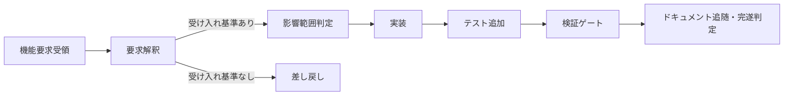

# 機能要求→実装→テストの一貫改修フロー — TASK-12.2-1

TASK-12.2-1（#81、REQ-12(b)）の成果物。REQ-12(b)（`docs/spec/04-requirements.md`）が
要求する「受け取った機能要求を、AI が実装・テスト追加・ドキュメント更新まで一貫して
改修するフロー」のうち、**機能要求の受付から実装・テスト追加まで**を扱う。

## 1. 目的・位置付け

親タスク TASK-12.2（#43）は 4h 粒度で 2 サブタスクに分解されている。

- **TASK-12.2-1（本書、#81）**: 機能要求→実装→テストの一貫改修フロー整備
- **TASK-12.2-2（#82、スコープ外）**: ドキュメント追随・完遂判定の組み込み

先行 TASK-12.1（#79/#80、REQ-12(a)）で「改善提案（検知・トリアージ→提案→承認→実装）」側の
フローは
[`improvement-proposal-flow.md`](./improvement-proposal-flow.md) として整備済みである。
本書はその対となる「**外部から受け取った機能要求を起点とする改修**」フローを、同じ
成果物パターン（機構 = `scripts/`、設計書 = `docs/design/`、運用規約 = `.claude/rules/`）
で定義する。両フローの違いは起点のみである。

| フロー | 起点 | 提案・要求の生成主体 |
|--------|------|----------------------|
| 改善提案フロー（TASK-12.1） | 自動検知（audit / unsafe / 依存 / 性能） | フレームワーク自身（CI・AI エージェントの能動分析） |
| 機能改修フロー（本書、TASK-12.2） | 外部からの機能要求（Issue） | 利用者・ステークホルダー |

## 2. フロー全体像

| 段階 | 内容 | 担い手 | 本書での扱い |
|------|------|--------|-------------|
| 機能要求受領 | Issue form（`.github/ISSUE_TEMPLATE/feature-request.yml`）で受付 | 利用者・ステークホルダー | **本書スコープ** |
| 要求解釈 | 受け入れ基準の存在確認。なければ差し戻し | AI エージェント（main） | **本書スコープ**（判定ロジック自体は TASK-12.3 への接続点） |
| 影響範囲判定 | 3 拡張点（`Middleware` / `UpgradeHandler` / `RequestGate`）・feature 構成への閉包判定 | AI エージェント（`explorer` 等） | **本書スコープ** |
| 実装 | パスベース委譲（[[delegation-impl]]）・pay-for-what-you-use 遵守 | `core-builder` / `plugin-builder` 等 | **本書スコープ** |
| テスト追加 | feature 構成別 `cargo test`・doc test・`scripts/feature-flow-check.sh` による同時性チェック | `test-runner` | **本書スコープ** |
| 検証ゲート | CI 全通過 + レビュー承認（自動マージ禁止） | 自動 CI + 人間レビュアー | **本書スコープ**（PR 必須ゲート化は #82） |
| ドキュメント追随・完遂判定 | CLAUDE.md / doc comment 更新の機械確認、完遂判定基準（REQ-14）への接続 | — | **#82 のスコープ** |

改修の**自動適用・自動マージは行わない**（改善提案フローと同一原則、フェイルクローズ）。
実装は必ず CI 通過とレビューゲートを経る。CI 完遂判定基準の詳細は
[`ci-completion-criteria.md`](./ci-completion-criteria.md)（REQ-14）を参照。

## 3. 機能要求の受付形式

`.github/ISSUE_TEMPLATE/feature-request.yml`（ラベル `feature-request`）で受け付ける。
必須項目:

| 項目 | 内容 |
|------|------|
| 概要 | 何を実現したいか（背景・課題を含む） |
| 受け入れ基準（必須） | 実装完了とみなせる具体的条件。**空では受付を成立させない**（Issue form の `validations.required: true`） |
| 影響範囲の想定 | 対象クレート・プラグイン・feature 構成・拡張点の想定 |

任意項目: 対象クレート/feature、依存・前提（他 Issue・マイルストーンへの依存）、
安全性方針との関係（unsafe の要否・OWASP Top 10 の観点）。

## 4. 要求解釈 — 受け入れ基準なし要求の差し戻し

Issue form の `validations.required: true` は GitHub 側の入力 UI レベルでの必須化に
留まり、API 経由の起票やテンプレート外の Issue には強制力が及ばない。したがって
AI エージェントは実装着手前に受け入れ基準の記載を確認し、欠けている場合は実装に
着手せず差し戻す（`.claude/rules/feature-modification.md` の運用規約として明文化）。

**「曖昧要求・危険要求の不可判定」の詳細ガードレール（可 / 不可 / 要エスカレーションの
判定基準）は TASK-12.3（#83/#84）のスコープ**であり、本書は「受け入れ基準の有無」という
機械的に確認可能な最小条件のみを扱う。

## 5. 影響範囲判定

実装着手前に、要求が以下のいずれに閉じるかを判定する（[[coding-rust]] の拡張点原則に
従う）。

- 3 拡張点（`Middleware` / `UpgradeHandler` / `RequestGate`）のいずれかに載る変更か
- 特定の `crates/plugin-*` に閉じる変更か（pay-for-what-you-use、feature ゲート要否）
- コア（`crates/core` / `crates/http` / `crates/routes`）へ影響する変更か

影響範囲が広い（コア変更・複数プラグイン横断）場合は `docs/dep-impact/` の計測結果も
参照し、パスベース委譲（[[delegation-impl]]）の分岐先を確定させてから実装に進む。

## 6. 実装 — テスト追加の機械同時性チェック

REQ-12(b) の「実装・テスト追加まで一貫」を機械的に担保するため、
`scripts/feature-flow-check.sh` を新設した。

- `git diff --name-only -z <base>...<head>` で `crates/<name>/src/**/*.rs` の変更を検出
- 同一クレートに `crates/<name>/tests/**` の変更、または src 差分の追加行に
  `#[test]` / `#[tokio::test]` / `#[cfg(test)]` / doc test フェンス（`/// \`\`\``）が
  なければ **フェイルクローズ**（非 0 終了）
- `--allow-no-tests <crate> "<理由>"` で理由必須の明示的除外が可能（暗黙スキップは
  設けない。除外時も警告を出力し、レビューで人間が理由を確認する前提）

セルフテスト `scripts/tests/run-feature-flow-tests.sh` は一時 git リポジトリの fixture
で判定パターンを検証し、`.github/workflows/ci.yml` の `unsafe-triage` ジョブから実行する
（ネットワーク・cargo ビルド不要、`scripts/tests/run-triage-tests.sh` と同じ設計方針）。

**`feature-flow-check.sh` 本体を PR の必須ゲート（CI 上で実際に base/head diff を取って
失敗させる運用）として組み込む対応は #82（完遂判定への組み込み）のスコープ**とする。
本タスクでは機構本体とセルフテストの提供に留め、既存 PR フローを壊さない安全側の
判断とした。

## 7. 検証ゲート

- feature 構成別 `cargo test`（`--no-default-features` / default / 各 feature 単体 /
  `--all-features`）と doc test（`cargo test --doc`）
- `cargo fmt --check` / `cargo clippy --all-features -- -D warnings`
- `scripts/feature-flow-check.sh --base origin/main`（ローカル実行。CI 必須ゲート化は #82）
- CI 全ジョブ（`ci-complete` 集約ゲート、[`ci-completion-criteria.md`](./ci-completion-criteria.md)）green

## 8. TASK-12.3・#82 との境界

| 事項 | 扱い |
|------|------|
| 受け入れ基準の存在確認（本書 4 節） | 本タスク |
| 曖昧要求・危険要求の可否判定（可 / 不可 / 要エスカレーション） | TASK-12.3（#83/#84）— 本書は接続点のみ明記 |
| `feature-flow-check.sh` の PR 必須ゲート化 | #82 |
| ドキュメント追随ステップ（CLAUDE.md / doc comment 更新の機械確認） | #82 |
| 完遂率等の数値検証 | TASK-12.4〜12.7 |

## 9. セキュリティ考慮事項（OWASP Top 10 観点）

- **A03 インジェクション**: Issue form の入力（要求本文・受け入れ基準）は信頼できない
  外部データとして扱い、スクリプト・CI でシェル再解釈・`eval` に渡さない
  （[`improvement-proposal-flow.md`](./improvement-proposal-flow.md) 7 節と同一規約）。
  `feature-flow-check.sh` は変更ファイル一覧を `git diff --name-only -z` で NUL 区切り
  取得し、`--allow-no-tests` の理由文字列は表示のみでコマンドに展開しない。
- **A01 最小権限**: `.github/workflows/ci.yml` の `permissions: contents: read` を維持し、
  新規ステップ（セルフテスト実行）は権限追加なし。
- **A04 安全でない設計の防止**: 「自動適用・自動マージ禁止、CI 通過 + レビューゲート
  必須」を本書 2 節で明文化（REQ-12・改善提案フローと同一原則）。
- **A05 フェイルクローズ**: `feature-flow-check.sh` は違反検知時に非 0 終了。除外は理由
  必須の明示フラグのみで、暗黙スキップを設けない。
- **シークレット混入防止**: 新規ファイル（Issue form・スクリプト・fixture）に鍵・トークン
  を含めない。fixture は合成データのみ（`scripts/tests/run-feature-flow-tests.sh`）。

## 関連ドキュメント

- 運用規約（エージェント向け要約）: [`.claude/rules/feature-modification.md`](../../.claude/rules/feature-modification.md)
- 改善提案フロー（対になるフロー）: [`improvement-proposal-flow.md`](./improvement-proposal-flow.md)
- CI 完遂判定基準: [`ci-completion-criteria.md`](./ci-completion-criteria.md)
- スクリプト仕様: [`scripts/README.md`](../../scripts/README.md)
- 委譲マッピング: [`.claude/rules/delegation-impl.md`](../../.claude/rules/delegation-impl.md)
- スコープ外課題の追跡規約: [`.claude/rules/out-of-scope-tracking.md`](../../.claude/rules/out-of-scope-tracking.md)
- セキュリティ規約: [`.claude/rules/security.md`](../../.claude/rules/security.md)
