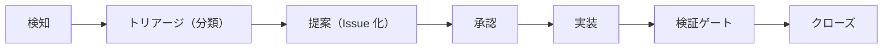

# 改善提案フロー — TASK-12.1-2

TASK-12.1-2（#80、REQ-12(a)）の成果物。TASK-12.1-1（#79）で実装済みの検知・トリアージ機構
（`scripts/audit-triage.sh` / `scripts/unsafe-triage.sh` / `.github/workflows/ci.yml` の
`dep-audit` / `unsafe-triage` ジョブ）を、どう「改善提案」として提示し、誰の承認を経て
実装・検証・クローズに至るかのフロー・規約を定義する。

## 1. 目的・位置付け

REQ-12(a)（`docs/spec/04-requirements.md`）は「AI がコードベース・依存・性能・脆弱性を
分析し改善案を能動的に提示する機構」を要求する。親タスク TASK-12.1（#42）の下で:

- **TASK-12.1-1（#79）**: 検知・トリアージの機構本体（スクリプト・CI ジョブ）を実装済み
- **TASK-12.1-2（本書、#80）**: 機構が生成する結果を「改善提案」として運用するフロー・規約を定義
- **TASK-12.2**: 改善提案の実装（追加機能改修フロー） — 本書のスコープ外
- **TASK-12.3**: 対応可否自律判断ガードレール（可 / 不可 / 要エスカレーションの判定規約） — 本書のスコープ外

本書は「検知結果をどう改善提案として提示し、承認・実装・検証を経てクローズするか」の
フロー定義に責務を限定する。個々の判定ロジック（TASK-12.3）や実装の詳細手順
（TASK-12.2）には立ち入らない。

## 2. 改善提案フロー全体像

| 段階 | 内容 | 担い手 |
|------|------|--------|
| 検知 | `cargo audit` / `unsafe` 差分 / 依存構成 / ベンチ結果を収集 | 自動 CI（スケジュール実行） |
| トリアージ（分類） | 検知結果を対応区分に分類しレポート化 | 自動 CI（`scripts/*-triage.sh`） |
| 提案（Issue 化） | トリアージ結果を「改善提案」として Issue 化（3.4 節の提示形式に従う） | 自動 CI（`audit-triage` ラベル）または AI エージェント（能動分析） |
| 承認 | 提案内容の妥当性を確認し実装可否を判断 | 人間（レビュアー／ユーザー） |
| 実装 | 承認された提案を実装 | AI エージェント（`core-builder` 等の delegation 先） |
| 検証ゲート | CI 全通過（`fmt` / `clippy -D warnings` / `test` 等）とレビュー承認 | 自動 CI + 人間レビュアー |
| クローズ | 検証ゲート通過後に Issue・PR をクローズ | 人間（マージ操作） |

改善提案の**自動適用・自動マージは行わない**（フェイルクローズ）。実装は必ず CI 通過と
レビューゲートを経る。CI 完遂判定基準の詳細は
[`ci-completion-criteria.md`](./ci-completion-criteria.md)（REQ-14）を参照。

## 3. 4 分析軸と入力ソースの対応表

REQ-12(a) が挙げる「コードベース・依存・性能・脆弱性」の 4 分析軸それぞれについて、
入力ソースと現状の実装状況を整理する。

| 分析軸 | 入力ソース | トリアージ／検知手段 | 提案への接続 |
|--------|-----------|----------------------|-------------|
| 脆弱性 | `cargo audit` の advisory DB | `scripts/audit-triage.sh`（自動更新提案 / 要エスカレーション / 情報の 3 区分） | schedule / workflow_dispatch 実行時に `audit-triage` ラベル付き Issue を自動起票 |
| コードベース（unsafe） | `crates/*/src`・`crates/*/tests` の `unsafe` 使用箇所 | `scripts/unsafe-triage.sh`（`unsafe-baseline.json` に対するラチェット検知・`// SAFETY:` コメント欠落検知） | CI 失敗として提示（`.claude/rules/coding-rust.md` の機械強制。Issue 自動起票は現状なし） |
| 依存 | `cargo deny check`・feature 構成別の依存グラフ | `scripts/dep-audit.sh`（全 feature 構成横断の `cargo deny check`）・`scripts/dep-impact.sh`（依存クレート数・バイナリサイズ・`unsafe` 件数の計測、`docs/dep-impact/README.md` 参照） | pay-for-what-you-use 違反・依存肥大の兆候を AI エージェントが能動分析し改善提案（本書 3.5 節「エージェントレイヤ」） |
| 性能 | `benches/`（Criterion ベンチ・`benches/reports/`） | axum 参照実装との比較・退行検知（ベンチ運用は `benches/README.md` 参照） | 性能退行検知時に AI エージェントが能動分析し改善提案（本書 3.5 節「エージェントレイヤ」） |

依存・性能の 2 軸は現状 CI 上の自動起票ジョブを持たない。AI エージェントが定期調査・
レビュー委譲（`explorer` / `bench-builder` 等）の過程で兆候を検知した場合に、本書 4 節の
提示形式・5 節の承認規約に従って改善提案を起票する。

## 4. 改善提案の提示形式（テンプレート）

改善提案の Issue・レポートには、REQ-12 受け入れ基準「自動監査タスクで影響範囲と対応方針を
提示でき、人手評価で妥当性 80% 以上」を満たすため、以下を**必須記載**とする。

| 項目 | 内容 |
|------|------|
| 背景・根拠データ | トリアージ出力・ベンチ結果・依存グラフ等、検知に使った一次データへの参照 |
| 影響範囲 | どのクレート・プラグイン・feature 構成・利用者に影響するか |
| 対応方針（推奨アクション） | 具体的な次アクション（例: `cargo update -p <crate>` / `deny.toml` ignore 追加 / 記録のみ） |
| 検証方法 | 対応後にどう確認するか（再実行するスクリプト・CI ジョブ名） |
| リスク | 対応した場合／しなかった場合のリスク |

必須項目を欠く提案は「改善提案」として扱わず、追加調査を要する下書きとして扱う。

## 5. 承認・起票規約の 2 レイヤ整理

改善提案の起票は、承認の要否が異なる 2 レイヤに分かれる。

### 5.1 自動レイヤ（承認不要）

- CI（フレームワークの自動監査機構）による `dep-audit` ジョブの `audit-triage` ラベル
  Issue 起票（schedule / workflow_dispatch 実行時限定）は、既存実装の追認であり承認不要。
- 重複起票防止は `gh issue list --search "<advisory_id>" --state open --label audit-triage`
  による既存 Issue 検索で行う（`.github/workflows/ci.yml` の `dep-audit` ジョブ参照）。
- 本レイヤの Issue 起票権限（`GITHUB_TOKEN`）は `issues: write` のみを付与し、workflow
  全体の `permissions: contents: read` を維持する（最小権限、OWASP A01 対策）。

### 5.2 エージェントレイヤ（承認前提）

- AI エージェントが能動的な分析（依存・性能・コードベースの調査）から新規に改善提案 Issue
  を起票する場合は、`.claude/rules/out-of-scope-tracking.md` と同一原則でユーザー承認を
  前提とする。
- 提案ラベルは `improvement-proposal` を用いる（`audit-triage` ラベルとは区別し、自動起票
  レイヤと混同しない）。
- 既存 Issue の有無を `gh issue list --search "<KEYWORD>" --state open` で確認してから
  承認を得る（`out-of-scope-tracking.md` の既存フローを踏襲）。

## 6. トリアージ区分ごとの対応規約

`scripts/audit-triage.sh` の 3 区分（`scripts/README.md` の既存記述と一致させる）に
対応する対応規約:

| 区分 | 対応規約 |
|------|---------|
| 自動更新提案 | `cargo update -p <crate>` を提案として提示。適用は承認後の PR 上で行い、全 feature 構成での `scripts/dep-audit.sh` 再実行と CI 通過を条件とする（無検証適用は認めない） |
| 要エスカレーション | 代替 crate 検討または `deny.toml` の ignore 追加を検討。ignore 追加は理由必須・ユーザー承認必須（本書 5.2 節と同一原則） |
| 情報（記録・監視） | 記録・監視のみ。CI を失敗させない（フェイルクローズの例外ではなく、区分自体が「対応不要」を意味する） |

## 7. セキュリティ考慮事項（OWASP Top 10 観点）

- **A03 インジェクション**: advisory 由来文字列（id・title・description）は信頼できない
  外部データとして扱い、`eval`・シェル再解釈・Issue 本文へのそのままの埋め込みからの
  コマンド例生成に使わない（`.github/workflows/ci.yml` の `audit-triage` ステップの既存
  方針を本書でも規約として維持する）。
- **A01 / A04 アクセス制御・安全でない設計**: 改善提案の自動適用・自動マージを禁止する
  （本書 2 節）。実装は必ず CI 通過 + レビューゲート（REQ-14）を経由する。`deny.toml`
  ignore 追加は理由必須・ユーザー承認必須（本書 6 節）。
- **A02 / シークレット**: 提案 Issue・トリアージレポートにトークン・鍵・PII を含めない
  （`.claude/rules/security.md` 準拠）。CI の Issue 起票は `GITHUB_TOKEN` を
  `issues: write` の最小権限に限定し、権限拡大を推奨しない（本書 5.1 節）。
- **A05 設定ミス**: フェイルクローズ原則（vulnerability 検知時は CI を非 0 で終了させる）
  を維持し、握りつぶし禁止・`main` エージェントからユーザーへの報告を改善提案フローの
  必須ステップとする（`.claude/rules/security.md` のフローと整合）。
- **A06 脆弱な依存**: 「自動更新提案」区分でも `cargo update` の無検証適用を認めず、全
  feature 構成での `dep-audit.sh` 再実行・CI 通過を更新条件とする（本書 6 節）。
- **DoS / 運用**: 自動起票の重複防止（`gh issue list` 検索）を維持し、Issue 洪水を防ぐ
  （本書 5.1 節）。

## 関連ドキュメント

- 運用規約（エージェント向け要約）: [`.claude/rules/improvement-proposal.md`](../../.claude/rules/improvement-proposal.md)
- スクリプト仕様: [`scripts/README.md`](../../scripts/README.md)
- CI 完遂判定基準: [`ci-completion-criteria.md`](./ci-completion-criteria.md)
- 依存インパクト計測: [`docs/dep-impact/README.md`](../dep-impact/README.md)
- スコープ外課題の追跡規約: [`.claude/rules/out-of-scope-tracking.md`](../../.claude/rules/out-of-scope-tracking.md)
- セキュリティ規約: [`.claude/rules/security.md`](../../.claude/rules/security.md)
