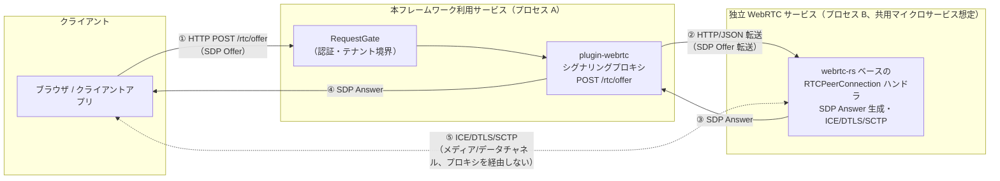

# WebRTC プラグインの別プロセス切り出し設計

- **対応タスク**: [TASK-8.2](../spec/05-tasks.md)「別プロセス・別サービスへの切り出し設計【Conditional Go 条件(2)】」のうち
  TASK-8.2-1（設計ドキュメント作成、本ドキュメント）。TASK-8.2-2（シグナリングプロキシプラグイン実装）は別 Issue（#74）
- **対応要件**: [REQ-8](../spec/04-requirements.md)「WebRTC プラグイン（別プロセス切り出し設計）」、[NFR-4](../spec/04-requirements.md)
- **前提タスク**: TASK-8.1（パスインターセプト型 WebRTC ハンドラの PoC 実装。`docs/spec/03-poc/webrtc-plugin/`）
- **ステータス**: 設計確定（実装は #74 で TASK-8.2-2 として着手）

本フレームワークの正式名称は `fandhe-backend`（#200 で確定）のため、本ドキュメントでは「本フレームワーク（fandhe-backend）」と表記する。

## 1. 背景と設計判断の根拠

`webrtc-rs`（0.17.1 系）は本フレームワークの他プラグインと比較して桁違いの依存インパクトを持つことが
PoC-5 で実測されている（`docs/spec/03-poc/webrtc-plugin/README.md`「結果」7 節、`docs/spec/04-requirements.md`
Conditional Go 条件(2)、196〜214 行の REQ-8 詳細）。

| 観点 | WebSocket | GraphQL | hub 配線 | OpenAPI | **WebRTC** |
|---|---:|---:|---:|---:|---:|
| 依存クレート増分 | +35 | +95 | +9 | +8 | **+189（約 10.9 倍）** |
| バイナリサイズ増分 | — | — | — | +0.03%（実質ゼロ） | **約 10.4 倍** |
| `unsafe` Functions 増分比 | — | — | — | 約 3.0 倍 | **約 2.2 倍** |
| `cargo audit` 既知脆弱性 | — | — | — | 0 件 | **0 件** |

（WebSocket・GraphQL・hub 配線・WebRTC の増分クレート数、`unsafe` Functions 約 2.2 倍、既知脆弱性 0 件は
`docs/spec/04-requirements.md` 38 行目 Conditional Go 条件(2) の記載による。OpenAPI の比較値
（バイナリサイズ +0.03%・`unsafe` Functions 約 3.0 倍・既知脆弱性 0 件）は `docs/spec/03-poc/webrtc-plugin/README.md`
「結果」7 節の比較表（92〜95 行目）による。WebRTC 単独の詳細実測は同 README「結果」2〜4 節を参照）

feature `plugin-webrtc` を無効化すればコアの依存ツリー・バイナリ・`unsafe` に一切影響しないこと
（pay-for-what-you-use の成立）は PoC-5 で確認済みである（同 README「成功基準との照合」表、107 行目）。
一方で、**`plugin-webrtc` を有効化したサービス自身**は、DTLS/SCTP/ICE の低レイヤー実装（`ring`・`rustls`・
`webrtc-ice`・`webrtc-sctp` 等）を直接抱えることになり、本フレームワークの核となる安全性動機
（攻撃表面最小化・監査容易性）の恩恵を実質的に受けられない。これは feature 設計の巧拙で解消できる問題ではなく、
WebRTC というプロトコルスタック自体の複雑さに起因する構造的な制約である
（`docs/spec/03-poc/webrtc-plugin/README.md`「発見事項」112 行目）。

### 2 案の比較と採用理由

`docs/spec/02-poc-plan.md` の PoC-5 リスク・懸念事項が示唆した 2 案を検討する
（`docs/spec/03-poc/webrtc-plugin/README.md` 99 行目「結論（根拠付き）」を踏襲）。

| 案 | 内容 | 評価 |
|---|---|---|
| (a) コア安全性方針の例外扱い | `plugin-webrtc` 有効時のみ攻撃表面拡大を許容する例外規定を設ける | 「WebRTC を使うサービス」と「使わないサービス」の境界がプロセス内に留まり、依存ツリー全体が同一バイナリに同居し続ける。監査対象範囲の分離ができず、本フレームワークの安全性動機（AI によるセキュリティ脆弱性発見リスクへの備え）と正面から矛盾する |
| **(b) 別プロセス切り出し（採用）** | WebRTC の実処理（ICE/DTLS/SCTP/SRTP/メディア）を独立プロセス・独立サービスへ切り出し、本フレームワーク側は軽量なシグナリングプロキシのみをプラグインとして提供する | 監査対象範囲が独立サービスに閉じ、本フレームワークのコア・WebRTC 以外のプラグインを使う大多数のサービスは無傷。Fandhe の共用 WebRTC マイクロサービス構想（`docs/spec/01-brainstorm.md` 9・56・129 行目）とも方向性が一致する |

**結論**: (b) 別プロセス切り出しを採用する。REQ-8（`docs/spec/04-requirements.md` 199 行目）でも
「実装方式（コアへ密結合させず別プロセス・別サービスへ切り出す設計）は PoC-5 の結論を変更なく維持する」と
明記されており、本ドキュメントはこの方針を実装可能な設計へ具体化するものである。

## 2. 設計目標・非目標

### 目標

- コアおよび WebRTC を使わない大多数のサービスの監査対象範囲（依存ツリー・`unsafe`・バイナリ）を汚染しない
- `plugin-webrtc`（シグナリングプロキシ）自体は軽量に保つ。依存増分は WebSocket 級（+35 クレート程度）以下に
  抑える方針とし、`webrtc-rs` 本体・その低レイヤー依存（`webrtc-ice`・`webrtc-sctp`・`dtls`・`turn`・`stun` 等）
  には一切依存しない
- feature `plugin-webrtc` 無効時の pay-for-what-you-use を維持する（`.claude/rules/pay-for-what-you-use.md`、本ドキュメント
  「6. pay-for-what-you-use 検証方針」）
- 独立 WebRTC サービスとの連携インターフェースを、Fandhe の共用 WebRTC マイクロサービス構想側の詳細仕様が
  確定していない現時点でも設計・実装に着手できる形で規定する

### 非目標（実装フェーズ別タスクへ送るもの）

- トリクル ICE・STUN/TURN 対応（NAT 越え）・複数データチャネル・接続クローズ時のリソース解放処理
  （REQ-8 のスコープ外事項、`docs/spec/04-requirements.md` 205 行目。実装フェーズで別途設計）
- `webrtc-rs` v0.17→v0.20（Sans-I/O）移行のバージョン戦略の意思決定（TASK-8.3、担当: 人間）
- シグナリングプロキシプラグインの実装そのもの（#74、TASK-8.2-2）
- 攻撃表面の再評価・`AGENTS.md` への安全性方針明記・受け入れテストの実施（TASK-8.4）

## 3. アーキテクチャ

WebRTC のデータチャネルは SDP 交換後、SCTP/DTLS/ICE の独立した UDP セッション上で動作し、シグナリングに
使った HTTP/TCP 接続を奪取する必要がない（`docs/spec/03-poc/webrtc-plugin/README.md` 25 行目）。この性質を
利用し、シグナリング（HTTP）とメディア/データチャネル（UDP、独立セッション）の系統をプロセス境界としても分離する。

### 構成要素

1. **`plugin-webrtc`（シグナリングプロキシ）**: 本フレームワーク利用サービス内で動作する feature ゲート済み
   プラグイン。GraphQL・PoC-5 の WebRTC ハンドラと同型の「リクエスト/レスポンス完結型ハンドラ」として
   `POST /rtc/offer` を受理し、`RequestGate` を通過したリクエストのみを独立 WebRTC サービスへ転送する
   （PoC-5・REQ-8 で確立済みの拡張パターンをそのまま踏襲し、新しい拡張点は追加しない）。
   `webrtc-rs` には依存しない。
2. **独立 WebRTC サービス**: `webrtc-rs`（または将来の v0.20 系）を抱え、`RTCPeerConnection` 生成・
   SDP Answer 生成・ICE 候補収集・DTLS ハンドシェイク・SCTP セッション確立を担う別プロセス。
   本ドキュメントでは Fandhe の共用 WebRTC マイクロサービス構想がこの役割を担う前提とする
   （詳細は「7. Fandhe 共用 WebRTC マイクロサービス構想との整合」参照）。
3. **クライアント⇄独立 WebRTC サービス間のメディア/データチャネル**: SDP 交換完了後、ICE/DTLS/SCTP は
   クライアントと独立 WebRTC サービスの間で直接確立される。プロキシ（プロセス A）はこの経路を一切経由しない。
   これにより、プロセス A はメディアデータのボリューム・低レイヤープロトコル処理から完全に切り離される。

## 4. 連携インターフェース

### プロトコル

プロキシ⇄独立 WebRTC サービス間は **HTTP/JSON による SDP Offer/Answer 転送**を第一候補とする。

- **選定理由**: プロキシ側のクライアント向けインターフェース（`POST /rtc/offer`、JSON ボディ）と対称的な形にでき、
  実装をシンプルに保てる。追加の RPC フレームワーク・バイナリプロトコルの依存を持ち込まずに済み、
  「軽量な依存に留める」という設計目標（本ドキュメント「2. 設計目標」）と整合する
- **代替案**: gRPC（型付き契約・双方向ストリーミングの将来拡張に有利だが、プロキシ側に gRPC クライアント依存を
  追加する必要があり、依存最小化の目標と緊張関係にある）。独立サービス側の実装言語・フレームワークが
  Fandhe の共用マイクロサービス構想側で確定した時点で再検討する

### タイムアウト・リトライ・エラー伝播

- プロキシから独立サービスへの転送にはタイムアウトを設定する。非トリクル ICE を独立サービス側で採用する場合、
  ICE 候補収集完了待ち（`gathering_complete_promise`、PoC-5 実測ではローカルループバックで数十ミリ秒〜1秒未満、
  `docs/spec/03-poc/webrtc-plugin/README.md`「発見事項」114 行目）がこのタイムアウト設計に直接影響するため、
  独立サービス側の ICE 方式（非トリクル/トリクル）と合わせて具体値を確定する
- 独立サービスへの転送失敗（接続不可・タイムアウト・5xx 応答）は、クライアントへ 5xx として伝播する。
  再試行はクライアント起因の SDP 不正（4xx 相当）とは区別し、リトライ可能なエラーのみ限定的にリトライする方針とする
- サービスディスカバリは MVP では環境変数によるエンドポイント固定設定とする（本ドキュメント「5. セキュリティ設計」の
  SSRF 対策とも整合）

転送スキーマ・エラー型・リトライ回数等の詳細は実装時（#74）に確定する（本ドキュメント「8. 引き渡し事項」参照）。

## 5. セキュリティ設計

`docs/spec/04-requirements.md`・本リポジトリ `.claude/rules/security.md` の OWASP Top 10 観点に従い、
境界別に設計要件を整理する。

### クライアント → プロキシ（プロセス A 内）

- **入力検証**: プロキシは SDP を意味解釈せず不透明なバイト列として扱う場合でも、`Content-Type`・
  ボディサイズ上限・エンコーディング（UTF-8）は入口で検証する
- **リソース枯渇（DoS）**: `POST /rtc/offer` のボディサイズ上限・同時リクエスト数・スロークライアント対策
  （読み込みタイムアウト）を設計要件とする
- **認証・認可**: `RequestGate` を通過した後でのみプロキシに到達する配置とし（アーキテクチャ図の①）、
  hub 配線プラグイン（`plugin-hub-wiring`、JWT/`org_id`/テナント境界）がある場合はそれを迂回できない

### プロキシ → 独立 WebRTC サービス

- **ヘッダインジェクション対策**: SDP 本文を転送する際、改行混入等によるヘッダインジェクションを防ぐため、
  転送先へは JSON ボディとして送る（HTTP ヘッダへ SDP の値を直接埋め込まない）
- **SSRF 対策**: 転送先エンドポイントは環境変数等の固定設定のみとし、リクエスト内容（クライアント入力）から
  転送先 URL を組み立てないことを不変条件とする
- **サービス間認証**: プロキシ→独立サービス間を信頼境界として明示し、サービス間認証（mTLS または
  サービス間トークン等、hub 配線の JWT/テナント境界の仕組みとは別レイヤーで検討する）を設計要件とする。
  独立サービス側は、プロキシを経由しないリクエストを受理しない配置とする
- **転送タイムアウト**: 「4. 連携インターフェース」のタイムアウト方針を適用する

### 独立 WebRTC サービス自体

- **暗号・通信保護**: WebRTC のメディア/データチャネルは DTLS で保護される（`webrtc-rs` が担う）。
  証明書の生成・管理は独立サービス側の責務とし、本フレームワーク側では扱わない
- プロキシ⇄独立サービス間の通信は TLS で保護する方針とする（内部ネットワークであっても平文を許容しない）

### 可観測性・機密情報

- SDP には ICE 候補として IP アドレス等のネットワーク情報が含まれる。ログに SDP 全文・認証トークンを
  出力しない方針とする（`.claude/rules/security.md`・`.claude/rules/japanese-style.md` のログ方針と整合）

### 攻撃表面の分離効果（定量根拠）

本設計の目的そのものである。`webrtc-rs` の依存ツリー（DTLS/SCTP/ICE の低レイヤー実装が集中する領域、
`unsafe` Functions で約2.2倍・依存クレートで約 10.9 倍、本ドキュメント「1. 背景」参照）を独立サービスへ
隔離することで、本フレームワーク利用サービス（プロセス A）の監査対象範囲を汚染しない。
`plugin-webrtc`（プロキシ）自体が `webrtc-rs` に依存しないことがこの分離効果の前提条件であり、
「2. 設計目標」および「6. pay-for-what-you-use 検証方針」で不変条件として明記する。

## 6. pay-for-what-you-use 検証方針

`.claude/rules/pay-for-what-you-use.md` に従い、`plugin-webrtc`（シグナリングプロキシ）について次を
不変条件とする。

- `plugin-webrtc` feature 無効時、当該プラグインの依存・コード・`unsafe`・バイナリ増分がゼロであること
  （既存プラグインと同様の検証。REQ-8 受け入れ基準「WebRTC プラグイン無効時、その依存・`unsafe`・コードが
  コアのバイナリ・依存ツリーに 0 件で載らない」に対応）
- `plugin-webrtc` feature **有効時**であっても、プロキシ自体が `webrtc-rs`（および `webrtc-ice`・
  `webrtc-sctp`・`dtls` 等の低レイヤークレート）に**依存しない**こと。これは本設計（別プロセス切り出し）の
  前提条件そのものであり、この不変条件が破られるとプロキシプラグインが実質的に `webrtc-rs` を抱え込み、
  本設計の攻撃表面分離効果が失われる

### 検証手順（TASK-8.4 で実施）

| 検証 | コマンド | 期待結果 |
|---|---|---|
| feature 無効時の依存残留確認 | `cargo tree --edges normal --prefix none`（`plugin-webrtc` 無効構成） | `webrtc` 系クレートが 0 件 |
| feature 有効時の `webrtc-rs` 非依存確認 | `cargo tree --edges normal --prefix none`（`plugin-webrtc` 有効構成） | `webrtc`・`webrtc-ice`・`webrtc-sctp`・`dtls` 等の低レイヤークレートが 0 件 |
| `unsafe` 増減 | `cargo geiger` | `plugin-webrtc` 有効時の増分が WebSocket 級（+35 クレート相当）以下に収まる |
| バイナリサイズ比較 | feature 有効/無効でのリリースビルドサイズ差 | PoC-5 実測の約 10.4 倍増（`webrtc-rs` 直接統合時の値）を大きく下回る |
| 全構成ビルド | feature なし・`plugin-webrtc` 単独・全 feature の各構成で `cargo build` | 全構成でビルド成功 |

## 7. Fandhe 共用 WebRTC マイクロサービス構想との整合

`docs/spec/01-brainstorm.md`（9・56・129 行目）は Fandhe の「Rust 統一・共用 WebRTC マイクロサービス構想」を
本フレームワークの位置づけの一部として記載している。PoC-5 の発見事項では次が確認されている
（`docs/spec/03-poc/webrtc-plugin/README.md`「発見事項」115 行目）。

- `micro-service-hub` 配下には現時点で WebRTC 固有の配線仕様は**確認できなかった**（**未確定**）
- 「依存インパクトが大きいため別プロセス切り出しが望ましい」という PoC-5 の結論は、共用 WebRTC マイクロサービス
  構想（WebRTC を独立サービスとして共用する方向性）と方向性が一致する

本ドキュメント「3. アーキテクチャ」の「独立 WebRTC サービス」は、この共用マイクロサービス構想が担う想定で
設計している。ただし、共用サービス側の詳細インターフェース仕様（プロトコル・認証方式・エンドポイント形式等）は
本ドキュメント執筆時点で**未確定**である。このため「4. 連携インターフェース」は次の方針で設計しており、
共用サービス側の仕様確定後に調整可能な形とする。

- プロトコルは HTTP/JSON を第一候補としつつ代替案（gRPC 等）を明記し、共用サービス側の実装方式に応じて
  差し替え可能な設計とする
- サービスディスカバリは環境変数によるエンドポイント設定とし、共用サービスのデプロイ形態（Kubernetes Service
  名・内部 DNS 等）に依存しない
- サービス間認証は「プロキシ→独立サービス間の信頼境界」として抽象化し、共用サービス側の認証方式
  （mTLS・サービス間トークン等）を後から差し込める設計とする

共用構想の詳細仕様が確定した段階で、本ドキュメントの「4. 連携インターフェース」「5. セキュリティ設計」を
更新する。

## 8. #74（シグナリングプロキシ実装）への引き渡し事項

TASK-8.2-2（#74）で実装時に確定する項目のチェックリスト。

- [ ] 転送スキーマ（プロキシ⇄独立 WebRTC サービス間の JSON スキーマ、フィールド名・エラー表現）の確定
- [ ] エラー型の設計（`thiserror` 等でのエラー表現、5xx マッピングの詳細。`.claude/rules/coding-rust.md` の
      パニックをライブラリ境界に越えさせない方針に従う）
- [ ] feature 名の確定（`plugin-webrtc` を流用するか、シグナリングプロキシ専用の feature 名
      （例: `plugin-webrtc-proxy`）を新設するか。TASK-8.1 の PoC 実装 feature 名との関係を整理する）
- [ ] 設定項目の確定（転送先エンドポイントの環境変数名、タイムアウト値、ボディサイズ上限値）
- [ ] テスト観点: feature 無効時の依存 0 件（本ドキュメント「6. pay-for-what-you-use 検証方針」）、
      SSRF 対策（転送先固定の不変条件）、ボディサイズ上限・タイムアウトの単体テスト、
      独立サービスのモック（またはスタブ）を用いた転送成功/失敗経路の統合テスト
- [ ] サービス間認証方式の確定（本ドキュメント「7. Fandhe 共用 WebRTC マイクロサービス構想との整合」参照、
      共用サービス側仕様との調整が前提）

## 9. スコープ外・関連タスク

- **TASK-8.3**（webrtc-rs バージョン戦略の策定、担当: 人間）: v0.17→v0.20（Sans-I/O）移行時期・
  破壊的変更の許容度の判断。本ドキュメントの設計は独立サービス側の実装詳細に依存しないため、
  移行判断が本設計自体に影響することはない
- **TASK-8.4**（WebRTC プラグイン攻撃表面評価と受け入れテスト）: 本ドキュメント「6. pay-for-what-you-use
  検証方針」の検証手順の実施、`AGENTS.md` への安全性方針明記（REQ-8 受け入れ基準のうち `AGENTS.md` 側）
- **トリクル ICE・STUN/TURN 対応（NAT 越え）・複数データチャネル・接続クローズ時のリソース解放処理**:
  REQ-8 のスコープ外事項として申し送り、独立 WebRTC サービス側の実装フェーズで別途設計する
- 新規 Issue の起票は自動運転モードでは行わず、本ドキュメントの参照（TASK-8.3・TASK-8.4・#74）を
  記録するに留める
